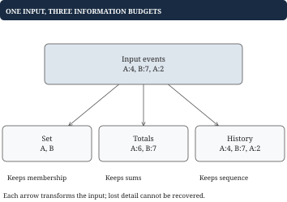

# Chapter 1 - Go and data structure choices

Suppose a service receives viewing events and must answer questions about them. Should it store a slice, a map, or both? This chapter teaches you to choose by the question the program must answer, and to express that choice safely in Go. Later chapters build algorithms and caches from these same decisions.

## One input, three different problems

Use these ordered events, where each pair is `(title, minutes)`:

`events = [("A", 4), ("B", 7), ("A", 2)]`

The required output determines what information must survive. A membership query asks whether A appeared at all. A totals query asks how many minutes A received. A history query asks which events came last. They are different problems even though their input is identical.



| Required answer | State to retain | Example result |
| --- | --- | --- |
| Has A appeared? | Set of title IDs | `{A, B}`; A is present |
| Total minutes per title | Map of sums | `{A: 6, B: 7}` |
| Last 2 events | Ordered records | `[(B, 7), (A, 2)]` |

A set loses durations and order. A totals map loses individual contributions and order. Keeping the complete history allows all three queries, but uses more memory and may require repeated scans. An optimization is justified only if the discarded information cannot affect the required answer.

## Go example: map lookup must distinguish zero from missing

A movie with 0 watched minutes is still a movie. Therefore a lookup returns both the record and a presence flag. Go's map lookup provides that flag directly.

```go
type Movie struct {
	Title   string
	Minutes int
}

func LookupMovie(movies map[string]Movie,
	id string) (Movie, bool) {
	movie, found := movies[id]
	return movie, found
}
```

For `movies = {"A": {Title: "A", Minutes: 0}}`, `LookupMovie(movies, "A")` returns the record and `true`; looking up B returns a zero-valued record and `false`. Testing `Minutes == 0` cannot distinguish them. The second result answers existence; the first answers value.

Use `make(map[string]Movie)` or `map[string]Movie{}` before assigning entries. Both create writable empty maps. `var movies map[string]Movie` creates a nil map: reading is allowed, but assigning into it panics. A set uses `map[string]struct{}` when only presence matters. Map iteration does not provide an agreed order; sort keys when output order is part of the contract.

## Choosing a structure by its next operation

Assume n resident records and bounded-size keys. The following costs explain what each structure buys. They are not interchangeable guarantees.

| Required operation | Starting structure | Cost and limitation |
| --- | --- | --- |
| Access position i | Slice | O(1); middle deletion usually shifts O(n) elements |
| Find a key | Map | Expected O(1); no recency or sorted order |
| Take newest unfinished item | Stack | O(1) pop; useful for nested work |
| Take oldest pending item | Queue | O(1) head advance; needs arrival order |
| Repeatedly take minimum | Min heap | O(log n) remove; root is O(1) |
| Move known item to front | Doubly linked list | O(1) with node reference; lookup still needs a map |
| Latest version before time t | Sorted history | O(log n) search; arbitrary insertion may shift O(n) |

Appending to a slice is amortized O(1): over n appends the total work is O(n), although an occasional append copies the existing array. Expected map cost also includes hashing the key; very long string keys are not free to process. Go does not supply a general ordered map in its standard library.

## Worked example: an index makes deletion a joint operation

Suppose `items = ["A", "B", "C"]` and `position = {A: 0, B: 1, C: 2}`. The map makes lookup fast. Delete B while preserving display order: the slice becomes `["A", "C"]`, so C's index must become 1.

| Step | Slice | Position map |
| --- | --- | --- |
| Before deletion | `[A, B, C]` | `{A: 0, B: 1, C: 2}` |
| Shift C left | `[A, C]` | C's old index 2 is now invalid |
| Repair the index | `[A, C]` | `{A: 0, C: 1}` |

The invariant is `items[position[id]] == id` for every resident ID. An invariant is simply a statement that must remain true after each public operation. Keeping two representations is useful only if updates preserve their agreement. LRU caches will apply this idea to a map and a linked list.

If order is irrelevant, replace the deleted item with the last item and shorten the slice. Only the moved item's index needs repair. That faster deletion changes behavior, so it must match the contract.

## Go example: a returned slice can share your internal storage

Copying a slice copies its descriptor, not its elements. If `b := a`, then changing `b[0]` can change `a[0]`. A service that exposes its internal history this way lets callers corrupt its state.

```go
func CopyIDs(ids []string) []string {
	// Give the caller independent element storage.
	result := make([]string, len(ids))
	copy(result, ids)
	return result
}
```

For `ids = ["A", "B"]`, modifying `CopyIDs(ids)[0]` does not change ids. The copy costs O(n) time and space. This is a shallow copy: if the elements themselves contain maps, slices, or pointers, the referenced objects can still be shared.

The same ownership issue appears when sorting. An in-place sort changes the caller's slice. Copy first if the API promises input preservation. Do not rely on an append happening to allocate a new backing array to provide isolation.

## Bytes, runes, and the unit of a string problem

The question "longest substring" needs a definition of character. In Go, indexing a string returns a byte. Ranging over a string decodes runes, but the range index is a byte offset. Converting to `[]rune` gives positions measured in Unicode code points.

| Text | UTF-8 bytes | Runes |
| --- | --- | --- |
| `"A"` | `[65]` | 1 |
| `"é"` | `[195, 169]` | 1 |
| `"Aé"` | `[65, 195, 169]` | 2 |

For ASCII-only anagrams, `[26]int` is a useful comparable map key. For arbitrary Unicode, that signature is insufficient. Even one rune is not always one human-perceived character: combining sequences can contain several code points. State the unit before selecting indexing rules.

Use `int64` when the permitted sums or timestamps need that width, and state that arithmetic must fit. Returning a boolean avoids inventing a sentinel such as -1 when -1 could be valid data. Invalid input should receive the error behavior promised by the API.

## Putting the program together: unique IDs in first-arrival order

The registry accepts event IDs and returns whether an ID is new. It also returns a protected snapshot of distinct IDs in first-arrival order. The empty string is a valid ID, and duplicates do not move an ID. A set answers membership; a slice answers order.

```go
type Registry struct {
	seen  map[string]bool
	order []string
}

func (r *Registry) Accept(id string) bool {
	if r.seen[id] {
		return false
	}
	if r.seen == nil {
		// Initialize on first write; the zero value works.
		r.seen = make(map[string]bool)
	}
	r.seen[id] = true
	r.order = append(r.order, id)
	return true
}

func (r *Registry) History() []string {
	return CopyIDs(r.order)
}
```

## Worked example: trace the registry's two views

| Call | Return | Set | Ordered history |
| --- | --- | --- | --- |
| `Accept("A")` | true | `{A}` | `[A]` |
| `Accept("B")` | true | `{A, B}` | `[A, B]` |
| `Accept("A")` | false | `{A, B}` | `[A, B]` |

The set and slice contain the same distinct IDs, and the slice stores each exactly once. Accept takes expected amortized O(1); History takes O(u) for u distinct IDs because it copies them. Adding removal would introduce new costs for preserving order. This is how a changed requirement can force a different representation.
