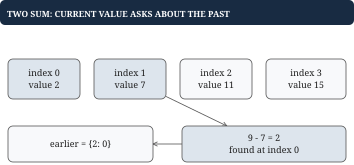
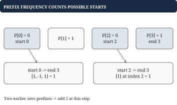
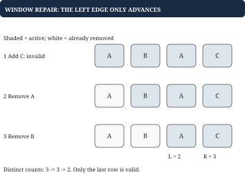

# Chapter 2 - Hashing, arrays, and sliding windows

This chapter solves problems over ordered arrays: finding a pair, grouping equivalent words, finding a contiguous region, counting exact-sum subarrays, and combining products. A hash map is useful only after you decide what its keys and values mean. The examples make those meanings visible before showing code.

## Two Sum: find two distinct positions

**Problem.** Given `nums = [2, 7, 11, 15]` and `target = 9`, return two different indices whose values add to 9. The answer is `[0, 1]`, because `2 + 7 = 9`. Return missing when no pair exists; do not reuse one element twice.

The slow baseline tries every pair, costing O(n²). When reading 7, the only question about the past is whether `9 - 7 = 2` occurred. A map from value to earlier index answers that question without another scan.



| i | Value | Needed value | Map before lookup | Action |
| --- | --- | --- | --- | --- |
| 0 | 2 | 7 | `{}` | Store `2: 0` |
| 1 | 7 | 2 | `{2: 0}` | Return `[0, 1]` |

## Go example: look up before inserting

```go
func PairSum(nums []int, target int) ([2]int, bool) {
    earlier := make(map[int]int)
    for i, value := range nums {
        if j, found := earlier[target-value]; found {
            return [2]int{j, i}, true
        }
        earlier[value] = i
    }
    return [2]int{}, false
}
```

Before iteration i, the map contains only earlier positions. Therefore a hit supplies a distinct index. For `[3, 3]`, target 6, the first 3 is stored and the second finds it. Inserting first would let a single `[3]` match itself. Time is expected O(n), space O(n), assuming arithmetic fits int.

## Group Anagrams: define equivalence before hashing

**Problem.** Group `words = ["eat", "tea", "tan", "ate", "nat", "bat"]` by their letter counts. One valid result is `[["eat", "tea", "ate"], ["tan", "nat"], ["bat"]]`. Group order is unspecified, while word order within a group follows input order.

Sorting each word's letters gives a stable signature. For lowercase ASCII a-z, a `[26]int` count array avoids sorting. "abb" has counts a:1, b:2; "ab" has a:1, b:1. Presence alone would incorrectly treat them as equal.

```go
func AnagramGroups(words []string) [][]string {
    groups := make(map[[26]int][]string)
    for _, word := range words {
        var key [26]int
        for i := 0; i < len(word); i++ {
            key[word[i]-'a']++
        }
        groups[key] = append(groups[key], word)
    }
    result := make([][]string, 0, len(groups))
    for _, group := range groups {
        result = append(result, group)
    }
    return result
}
```

The function assumes every byte is a-z. Arrays are comparable Go map keys; slices are not. Equal count arrays identify equal multisets of letters. Time is O(total input bytes), with fixed-size signature work per word. Arbitrary Unicode requires a different signature and a stated normalization policy.

## Longest unique substring: keep a valid contiguous window

**Problem.** In `text = "ABBA"`, find the longest substring without a repeated rune. The answer is 2, from "AB" or "BA". A substring uses consecutive positions; sorting would change the problem.

Store the latest position of each rune and a left boundary. A repeated rune inside the window forces left past its earlier occurrence. An earlier occurrence outside the window does not force movement.

| right | Rune | Previous position | left after repair | Window |
| --- | --- | --- | --- | --- |
| 0 | A | Missing | 0 | `"A"` |
| 1 | B | Missing | 0 | `"AB"` |
| 2 | B | 1 | 2 | `"B"` |
| 3 | A | 0 | 2 | `"BA"` |

```go
func UniqueLength(text string) int {
    runes := []rune(text)
    last := make(map[rune]int)
    left, best := 0, 0
    for right, r := range runes {
        if previous, found := last[r]; found &&
            previous >= left {
            left = previous + 1
        }
        last[r] = right
        if length := right-left+1; length > best {
            best = length
        }
    }
    return best
}
```

The invariant is that `runes[left:right+1]` contains no duplicate. At the final A, assigning `left = 1` would move backward and reintroduce the two Bs. The guard prevents that. Both boundaries advance only, so time is O(n); rune conversion and the map use O(n) space.

## Worked example: why an existing prefix adds several answers

**Problem.** Count all nonempty contiguous subarrays summing to k, allowing negative values. For `nums = [1, -1, 1]`, `k = 1`, the answer is 3: `[1]` at index 0, `[1, -1, 1]`, and `[1]` at index 2. Distinct positions count separately even when values match.

A prefix sum is a cumulative total at a boundary. Define `P[0] = 0` and `P[j] = sum(nums[0:j])`. Then the sum of `nums[i:j]` is `P[j] - P[i]`. It equals k exactly when `P[i] = P[j] - k`.

For this input, `P = [0, 1, 0, 1]`. The two zero prefixes are at different boundaries. At the final prefix 1, subtracting either earlier zero produces a different subarray summing to 1.



The map stores **prefix value to number of earlier boundaries with that value**, not array value to count. Seed `{0: 1}` for the empty prefix before index 0.

| i | Running prefix p | Need p-k | Earlier frequency | Total answers |
| --- | --- | --- | --- | --- |
| 0 | 1 | 0 | 1 | 1 |
| 1 | 0 | -1 | 0 | 1 |
| 2 | 1 | 0 | 2 | 3 |

At index 1, recording the current prefix 0 changes its frequency from 1 to 2. At index 2, `frequency[0] == 2`, so add **2**, not 1. One start boundary gives the whole array; the other gives only its final element. A set would remember existence but lose this multiplicity.

## Go example: count matching boundaries before recording this one

```go
func SubarrayCount(nums []int, k int) int {
    frequency := map[int]int{0: 1}
    prefix, result := 0, 0
    for _, value := range nums {
        prefix += value
        result += frequency[prefix-k]
        frequency[prefix]++
    }
    return result
}
```

Before lookup, the map describes only earlier boundaries. Recording this boundary first would match a boundary with itself when `k == 0`, counting an empty subarray. For `[0, 0]`, k=0, the correct result is 3: each single zero and both zeros together. The second step legitimately adds 2 earlier starts.

This algorithm takes expected O(n) time and O(n) space. Prefix sums and the answer must fit int; use int64 if constraints require it. A positive-only sliding-window sum argument fails on signed values because removing a negative number increases the sum. Prefix subtraction remains valid regardless of signs.

## Product Except Self: combine both sides of a position

**Problem.** For `nums = [2, 3, 4]`, return `[12, 8, 6]`, where each output excludes its own input element. Division is unavailable, and zeros must work.

Fill each output with the product strictly to its left. Then multiply by the product strictly to its right while walking backward. An empty side contributes 1, the multiplicative identity.

| Position | Left product | Right product | Output |
| --- | --- | --- | --- |
| 0 | 1 | `3*4 = 12` | 12 |
| 1 | 2 | 4 | 8 |
| 2 | `2*3 = 6` | 1 | 6 |

```go
func ProductsExceptSelf(nums []int64) []int64 {
    out := make([]int64, len(nums))
    left := int64(1)
    for i, value := range nums {
        out[i] = left
        left *= value
    }
    right := int64(1)
    for i := len(nums)-1; i >= 0; i-- {
        out[i] *= right
        right *= nums[i]
    }
    return out
}
```

For `[2, 0, 4]`, the result is `[0, 8, 0]`; two zeros produce all zeros. Time is O(n), auxiliary space O(1) excluding output, assuming all intermediate products fit int64. The loop order matters: include the current value only after writing that position's strict-side product.

## Worked example: at most two distinct titles

**Problem.** Find the longest contiguous region in `titles = ["A", "B", "A", "C", "C"]` containing at most 2 distinct IDs. The answer is 3. Repetitions are allowed, unlike the unique-substring problem.

A frequency map describes the current window. After adding C, counts are `{A: 2, B: 1, C: 1}`. Removing one A leaves 3 distinct titles; remove B too to repair the window to `[A, C]`.



| Added | Window after repair | Counts | Best |
| --- | --- | --- | --- |
| A | `[A]` | `{A: 1}` | 1 |
| B | `[A, B]` | `{A: 1, B: 1}` | 2 |
| A | `[A, B, A]` | `{A: 2, B: 1}` | 3 |
| C | `[A, C]` | `{A: 1, C: 1}` | 3 |
| C | `[A, C, C]` | `{A: 1, C: 2}` | 3 |

## Putting the program together: repair before measuring

```go
func LongestTwo(titles []string) int {
    count := make(map[string]int)
    left, best := 0, 0
    for right, title := range titles {
        count[title]++
        for len(count) > 2 {
            old := titles[left]
            count[old]--
            if count[old] == 0 {
                delete(count, old)
            }
            left++
        }
        if length := right-left+1; length > best {
            best = length
        }
    }
    return best
}
```

Delete zero counts so `len(count)` means the number of distinct IDs. Use a loop because one removal may be insufficient. Measure only after validity is restored. Each element enters and leaves at most once, giving expected O(n) time. For the fixed bound of 2 titles, the map holds at most 3 keys during repair. Empty input returns 0.

The methods in this chapter retain different histories. Two Sum needs earlier positions; prefix counting needs earlier frequencies; a window needs only active-region state. Decide which future question the stored state must answer before choosing its representation.
