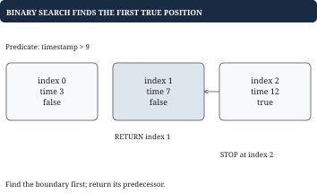

# Chapter 3 — Sorting binary search intervals and heaps

Ordering can turn a global search into a local decision. Decide whether you need full order, a boundary, or just the next best item.

## Two pointers after sorting

For Three Sum, find distinct value triples whose sum is zero. The cubic baseline tries all triples. Sort first, then fix one position and search the remaining suffix with a left and right pointer. If the sum is too small, moving right inward cannot increase it; move left forward. If it is too large, move right backward. Each pointer move rules out a family of impossible pairs.

For minus four, minus one, minus one, zero, one, two, fixing minus one allows the pairs minus one with two and zero with one. Skip repeated fixed values and repeated pair values after emitting a triple. The result is unique by values, not by indices. Sorting loses original positions unless you retain them. The full complexity is quadratic time after sorting, with output space proportional to the number of triples; copying to avoid input mutation adds linear space.

**Why the pointer move is justified.** When a pair sum is too small in a sorted array, keeping the left value and moving the right pointer inward cannot increase the sum.

With the same left value, every smaller right index gives a value no greater than the current right value, so none can fix a sum that is already too small. Sorted order supplies the comparison. “Because that is the pattern” is not a proof.

## Merge intervals by remembering one frontier

Suppose sessions occupy half-open intervals: start included, end excluded. Sort by start. Keep a current interval; if the next start is less than its end, the intervals overlap, so extend the end to the larger end. Otherwise emit the current interval and begin another. Once a gap is found, no later interval can bridge backward across it, because later starts are no smaller.

For two to five, one to three, and seven to nine, sorting gives one to three, two to five, seven to nine. The first two merge into one to five. The gap before seven finalizes that answer. If touching intervals should merge as continuous coverage, use less than or equal instead of strictly less. For concurrent viewer counts, touching half-open intervals do not overlap: a departure at time five is processed before an arrival at time five.

A sweep line generalizes merging to “maximum simultaneous sessions.” Turn starts into plus one events and ends into minus one events, sort by time with the agreed tie order, and track a running count and maximum. Merging answers union coverage; sweeping answers overlap counts. Reusing one algorithm without noticing this distinction is a common modeling error.

## Binary search asks for the first true position

Binary search requires a monotone predicate: false, false, then true for the rest. To find the latest metadata version at or before time fifteen in timestamps ten, twenty, thirty, search for the first timestamp greater than fifteen. That is index one; the answer is the previous entry, index zero. If the first true index is zero, there is no suitable version. If no index is true, all versions qualify and the final one is the answer.

```go
i := sort.Search(len(versions), func(i int) bool {
    return versions[i].Time > queryTime
})
if i == 0 { return "", false }
return versions[i-1].Value, true
```

Go's [sort.Search](https://pkg.go.dev/sort#Search) returns the first true index or the length, not minus one. The important skill is defining the predicate and handling both edges. For a hand-written version, use a half-open search range and compute middle as low plus half of high minus low. Every iteration must shrink the unresolved range.

In a rotated sorted array with distinct values, at least one half around the midpoint is sorted. Determine which half, check whether the target belongs in its value range, and discard the other. With duplicates, values at both ends and midpoint may fail to identify a sorted side; discarding equal endpoints can degrade to linear time. Do not promise logarithmic worst-case behavior under an assumption you have removed.

## A heap keeps only the ordering you need

A binary min heap is usually stored in a slice representing a complete binary tree. The root is index zero. For a node at index i, its children are at two times i plus one and two times i plus two; its parent is at integer division of i minus one by two. The invariant is that each parent is no greater than either child. This guarantees the root is smallest, but siblings and distant branches need not be ordered.

Insert at the end and move upward while the parent comparison is violated. To remove the minimum, move the last item to the root and repeatedly swap downward with the smaller child until the invariant holds. The height is logarithmic, so insertion and removal cost logarithmic time. Inspecting the root is constant time. Building a heap from a whole slice by repairing internal nodes bottom-up takes linear time; inserting every element separately costs O(n log n). Try drawing the slice three, eight, five, ten, nine: it is a valid heap even though eight appears before five.

To return the top k frequent titles, first count occurrences with a map. Sorting all u unique titles costs O(u log u) and is a fine baseline. If k is small, maintain a heap of at most k winners whose root is the worst retained candidate. A new candidate worse than the root cannot belong in the top k; a better one replaces it. The invariant is that after any processed prefix, the heap contains that prefix's best k candidates.

The complexity is expected O(n) for counting and O(u log k) selection, followed by O(k log k) if output must be ranked. Define deterministic ties, such as lower title ID winning equal counts. That means the heap's worst element has lower count, or a lexicographically larger ID at the same count. A reversed tie comparison silently returns the wrong boundary item. When k is one, treat the heap step as constant work.

Go's heap interface supplies length, comparison, swapping, appending, and removing the final slice item. Your type's Pop method removes the final element; `heap.Pop` rearranges the root there first. Calling the type's Pop directly bypasses heap repair. Changing a priority requires `heap.Fix` with a maintained index, or a fresh versioned record that makes old records stale. [Go heap documentation](https://pkg.go.dev/container/heap).

## Why order lets you stop looking

An efficient search is often built around a justified refusal to inspect some candidates. In an unordered list, discovering that one number is too small says little about the others. In a sorted list, that observation tells you about an entire region. The sorting step creates evidence that later decisions can exploit. When explaining an ordering algorithm, identify which candidates a step rules out and why they cannot contain the answer.

Binary search is not restricted to finding an exact value. Its deeper task is locating a boundary between false and true. Suppose versions exist at times ten, twenty, and thirty and you query time twenty. The predicate “version time is greater than twenty” is false, false, true. The first true version is too new; the previous version is the newest allowed one. The exact-match problem disappears into a boundary definition. This same reasoning supports first capacity that succeeds, first invalid position, and insertion points, provided the predicate really is monotone.

A heap deliberately creates less order. Think of a tournament where you know the current weakest retained winner, but you have not ranked every contestant. To select the best two candidates, compare each newcomer with that weakest winner. If the newcomer loses, it cannot enter the best two. If it wins, replace the weakest and repair the tournament. The complete order is unnecessary until the final two need to be printed.

Sorting and a heap are therefore not rival tricks with one always superior. If you need all results ranked, sorting is direct. If you only need a few winners from a large collection, maintaining a small boundary can save work. If you repeatedly update priorities and ask for the next task, a heap can retain useful state between calls. But if priorities change without heap repair, the stored comparisons become stale: the old tournament result is no longer evidence of today's winner.

## Worked example: binary search locates a boundary

A title's metadata versions were saved at times 3, 7, and 12. A query at time 9 needs the version at 7. Searching for an exact timestamp would miss the answer. Search instead for the first stored time greater than 9, then step back once.



Use the half-open search interval from low inclusive to high exclusive. Initially low is zero and high is three. The midpoint is one, containing seven. Seven is not greater than nine, so the first greater value must be to its right: low becomes two. The next midpoint is two, containing twelve. Twelve is greater than nine, so high becomes two. The boundaries meet at index two, and index one supplies the answer.

| Query time | First greater position | Returned version |
| --- | --- | --- |
| 2 | 0 | Missing: no predecessor |
| 7 | 2 | Time 7 |
| 9 | 2 | Time 7 |
| 20 | 3, past the end | Time 12 |

Writing the predicate in words makes the boundary cases follow from the same algorithm. An empty history has boundary zero and no predecessor. A query after every version has boundary equal to the history length and returns the last version. If equal write timestamps are allowed, the contract must also say which version wins; replacing the equal-time record before searching keeps the history unambiguous.

## Worked example: a heap keeps only useful order

Keep the three largest values seen in 4, 9, 2, 7, 5. A sorted list of every observation would work, but the query never asks for the complete order. Maintain a min heap containing only the three current winners. Its smallest member is the one most vulnerable to replacement.

| Incoming value | Retained values, shown sorted | Decision |
| --- | --- | --- |
| 4, then 9, then 2 | 2, 4, 9 | Fill three slots |
| 7 | 4, 7, 9 | Replace the root 2 |
| 5 | 5, 7, 9 | Replace the root 4 |

The sorted display in this table is for the reader. The heap itself guarantees only that its root is the smallest retained value and that every parent is no larger than its children. Sorting the three winners at the end produces presentation order. The incoming value needs comparison only with the weakest winner: if it cannot beat that one, it cannot enter the top three.

For movie records, the comparison must include the tie rule too. If smaller IDs win equal scores, the weakest winner among tied scores is the larger ID. A score-only heap can return an inconsistent subset even if a final sort makes that subset look orderly.

## Putting the program together: a time-based value store

Expose Set(key, value, timestamp) and Get(key, queryTime). Each key has its own ordered history. Writes must be nondecreasing for that key; an earlier timestamp is rejected, and a write at the same timestamp replaces the latest value. Get returns a value plus a found flag. An empty stored string is different from no suitable version.

The store has a map from key to a slice of version records. Each record contains a timestamp and value. Set finds that key's history. If it is empty, append the new version. Otherwise compare with the final timestamp: reject a smaller timestamp, replace the final value if equal, or append if larger. Reject before mutating so a failed call preserves the sorted-history invariant.

Get finds the history and searches for the first version whose timestamp is greater than the query. If that position is zero, return missing. Otherwise return the version immediately before it. If the search finds no greater version, its returned position is the history length, and the final version is the answer. A helper called firstAfter can isolate that boundary-search responsibility from the public method.

With quality at time ten equal to HD and at twenty equal to UHD, Get at fifteen returns HD. At nine it returns missing; at twenty it returns UHD; at thirty it still returns UHD. Replacing the time-twenty value with HDR changes the last three relevant answers without adding a duplicate timestamp. Attempting a time-twelve write afterward is rejected under this contract.

Set is amortized constant time for ordered writes. Get is logarithmic in the versions for the requested key, plus expected map lookup. Allowing arbitrary historical insertion changes Set: a sorted slice needs a search and potentially linear shifting. The new write contract should not silently invalidate Get's binary-search precondition.

## Go example: implement the predecessor search

The version timestamps must be strictly increasing; equal-time writes have already been resolved. This complete binary search narrows unresolved elements in [lo, hi). When that interval is empty, lo is the first greater position, possibly the slice length.

```go
type Version struct {
    At int64
    Value string
}

func VersionAt(v []Version, at int64) (string, bool) {
    lo, hi := 0, len(v)
    for lo < hi {
        mid := lo + (hi-lo)/2
        if v[mid].At <= at {
            lo = mid + 1
        } else {
            hi = mid
        }
    }
    if lo == 0 {
        return "", false
    }
    return v[lo-1].Value, true
}
```

For timestamps 3, 7, 12 and query nine, the first branch discards timestamps through seven. The second keeps twelve as the candidate boundary. The answer is the preceding record at seven. Empty input and a query before the first write both finish with lo equal to zero and return missing. A query after the final write finishes with lo equal to the slice length and returns its final record.

The explicit `lo == 0` guard prevents an index of minus one. There is no separate exact-match branch: the less-than-or-equal comparison sends an equal timestamp into the eligible prefix. Time is logarithmic in the number of versions; auxiliary space is constant.
