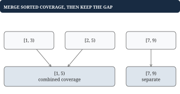

# Chapter 3 - Sorting, binary search, intervals, and heaps

This chapter solves problems where order lets you eliminate work. Sorting exposes directional comparisons, binary search finds a boundary, and a heap maintains only enough order to identify the next minimum. Begin by deciding which of these guarantees the output needs.

## Three Sum: use sorted order to eliminate pairs

**Problem.** Return unique value triples summing to 0 in `nums = [-1, 0, 1, 2, -1, -4]`. The result is `[[-1, -1, 2], [-1, 0, 1]]`, in any triple order. Each triple uses distinct positions; duplicate triples by value appear only once.

The cubic baseline tries every triple. Sort to `[-4, -1, -1, 0, 1, 2]`, fix one value, and use two pointers on the suffix. If a sum is too small, increasing left is the only useful direction: decreasing right cannot raise it. If too large, decrease right. One scan per fixed value gives O(n²) time.

| Fixed value | left value | right value | Sum | Action |
| --- | --- | --- | --- | --- |
| -1 | -1 | 2 | 0 | Emit `[-1, -1, 2]` |
| -1 | 0 | 1 | 0 | Emit `[-1, 0, 1]` |

```go
func ThreeZero(nums []int) [][3]int {
	// Sorting a copy preserves the caller's input order.
	a := append([]int(nil), nums...)
	sort.Ints(a)
	var out [][3]int
	for i := 0; i+2 < len(a); i++ {
		if i > 0 && a[i] == a[i-1] {
			continue
		}
		left, right := i+1, len(a)-1
		for left < right {
			sum := a[i] + a[left] + a[right]
			if sum < 0 {
				left++
			} else if sum > 0 {
				right--
			} else {
				out = append(out,
					[3]int{a[i], a[left], a[right]})
				// Skip values that would repeat this triple.
				x, y := a[left], a[right]
				for left < right && a[left] == x {
					left++
				}
				for left < right && a[right] == y {
					right--
				}
			}
		}
	}
	return out
}
```

Skipping equal fixed values and equal emitted pair values prevents duplicates. The function copies input before sorting, costing O(n) auxiliary space plus output. Sorting destroys original position order, so an index-based output would need extra bookkeeping. Integer sums must fit int.

## Merge intervals: retain the current coverage frontier

**Problem.** Combine overlapping coverage intervals `[[2, 5], [1, 3], [7, 9]]` into `[[1, 5], [7, 9]]`. For this exercise intervals are half-open `[start, end)`, and touching intervals also merge as continuous coverage. All intervals have `start < end`.

Sort by start. Keep the most recent merged interval. If the next start is at or before its end, extend the end; otherwise finalize it and start another. No later start can bridge a gap already passed.



```go
func MergeCoverage(input [][2]int) [][2]int {
	a := append([][2]int(nil), input...)
	sort.Slice(a, func(i, j int) bool {
		return a[i][0] < a[j][0]
	})
	var out [][2]int
	for _, interval := range a {
		last := len(out) - 1
		if last < 0 || interval[0] > out[last][1] {
			out = append(out, interval)
		} else if interval[1] > out[last][1] {
			// A nested interval must not shorten coverage.
			out[last][1] = interval[1]
		}
	}
	return out
}
```

Nested `[[1, 8], [2, 4]]` stays `[[1, 8]]`; do not shorten the end to 4. Empty input returns an empty result. Sorting dominates at O(n log n), and copies/output use O(n) space.

**Related problem: maximum concurrent sessions.** Union coverage and overlap counts need different state. For half-open `[1, 3)` and `[3, 5)`, simultaneous count is 1, even though this coverage contract merges them. A sweep represents a start as +1 and an end as -1, processing ends before starts at equal times.

| Time | Changes | Active after changes |
| --- | --- | --- |
| 1 | Start first | 1 |
| 3 | End first, start second | 1 |
| 5 | End second | 0 |

## Worked example: a predecessor is a boundary query

**Problem.** Metadata versions were written at `times = [3, 7, 12]`. At query time 9, return the latest version at or before 9: the one at 7. An exact-match search would miss it.

Search for the first timestamp greater than the query. For time 9, the predicate is `[false, false, true]`; its first true position is 2, so answer position 1. This false-then-true shape is the monotonicity binary search needs.


| Step | Unresolved range | mid | Time at mid | Change |
| --- | --- | --- | --- | --- |
| 1 | `[0, 3)` | 1 | 7 | Eligible; `lo = 2` |
| 2 | `[2, 3)` | 2 | 12 | Too late; `hi = 2` |
| End | `[2, 2)` | - | - | Return position 1 |

## Go example: search a half-open range

```go
type Version struct {
	At    int64
	Value string
}

func VersionAt(v []Version, at int64) (string, bool) {
	// Find the first version strictly after the query.
	lo, hi := 0, len(v)
	for lo < hi {
		mid := lo + (hi-lo)/2
		if v[mid].At <= at {
			lo = mid + 1
		} else {
			hi = mid
		}
	}
	if lo == 0 {
		return "", false
	}
	// Its predecessor is the latest eligible version.
	return v[lo-1].Value, true
}
```

Timestamps must be strictly increasing; equal-time writes are resolved before search. The unresolved range `[lo, hi)` shrinks every iteration. At termination lo is the first greater position, possibly len(v). Query 2 returns missing, query 7 returns the version at 7, and query 20 returns the last version. Time is O(log m) for m versions, auxiliary space O(1).

Go's `sort.Search` expresses the same predicate and returns the length if no position is true. It does not return -1. Searching a rotated sorted array needs a different directional argument: identify the sorted half, then decide whether the target lies in it.

```go
func RotatedIndex(a []int, target int) int {
	lo, hi := 0, len(a)-1
	for lo <= hi {
		mid := lo + (hi-lo)/2
		if a[mid] == target {
			return mid
		}
		if a[lo] <= a[mid] {
			// The left half is sorted, so test its bounds.
			if a[lo] <= target && target < a[mid] {
				hi = mid - 1
			} else {
				lo = mid + 1
			}
		} else {
			if a[mid] < target && target <= a[hi] {
				lo = mid + 1
			} else {
				hi = mid - 1
			}
		}
	}
	return -1
}
```

For `[4, 5, 6, 7, 0, 1, 2]`, target 0, the first comparison discards the sorted left half `[4, 5, 6, 7]`. This code assumes distinct values and takes O(log n). Duplicates can hide which half is sorted and require a different algorithm with O(n) worst-case behavior.

## What a heap guarantees

**Problem.** Repeatedly take the smallest pending priority without sorting the entire collection after every insertion. A min heap stores a complete binary tree in a slice. At index i, children are `2*i+1` and `2*i+2`; parent is `(i-1)/2` for i>0. Every parent is at most its children.

![The slice [3, 8, 5, 10, 9] is a valid min heap. Its root is smallest, but the entire slice is not sorted.](figures/heap-tree.svg)

Insertion appends, then swaps upward while the parent is larger. Removal replaces the root with the last value, then swaps downward with the smaller child until order is repaired. Both take O(log n); inspecting the root takes O(1). Bottom-up heap construction is O(n).

## Worked example: keep the three largest observations

For `stream = [4, 9, 2, 7, 5]`, maintain a min heap of at most k=3 winners. Its root is the weakest winner. Replace it only when the new value is larger.

| Arrival | Winners shown sorted | Decision |
| --- | --- | --- |
| 4, 9, 2 | `[2, 4, 9]` | Fill the slots |
| 7 | `[4, 7, 9]` | Replace root 2 |
| 5 | `[5, 7, 9]` | Replace root 4 |

The table sorts for display; the heap need not. Here is the upward repair used by the integer heap:

```go
func PushMin(h []int, value int) []int {
	h = append(h, value)
	for i := len(h) - 1; i > 0; {
		parent := (i - 1) / 2
		if h[parent] <= h[i] {
			break
		}
		h[parent], h[i] = h[i], h[parent]
		i = parent
	}
	return h
}
```

Replacing the root requires downward repair:

```go
func RepairMinRoot(h []int) {
	for i := 0; ; {
		child := 2*i + 1
		if child >= len(h) {
			return
		}
		if child+1 < len(h) && h[child+1] < h[child] {
			// Repair through the smaller child.
			child++
		}
		if h[i] <= h[child] {
			return
		}
		h[i], h[child] = h[child], h[i]
		i = child
	}
}

func LargestK(values []int, k int) []int {
	if k <= 0 {
		return nil
	}
	var h []int
	for _, value := range values {
		if len(h) < k {
			h = PushMin(h, value)
		} else if value > h[0] {
			// The root is the weakest retained winner.
			h[0] = value
			RepairMinRoot(h)
		}
	}
	sort.Sort(sort.Reverse(sort.IntSlice(h)))
	return h
}
```

Duplicates count as separate observations: `[5, 5, 2]`, k=2, returns `[5, 5]`. Time is O(n log(k+1)) plus final O(k log k) sorting, with O(k) storage when k<=n. The kth largest is the smallest retained winner when n>=k. For top-k frequency, first count by ID, then compare distinct records by frequency and the full tie rule. A worst-winner root must treat a larger ID as worse when smaller IDs win ties.

## Putting the program together: time-based values

A time store maps each key to an ordered `[]Version`. Set accepts nondecreasing write times: a smaller time fails without mutation, equal time replaces the final value, and a larger time appends. Get applies VersionAt to that key's history. Empty values remain valid hits.

```go
type TimeStore map[string][]Version

func (s TimeStore) Set(key, value string, at int64) bool {
	history := s[key]
	if len(history) > 0 {
		last := len(history) - 1
		if at < history[last].At {
			return false
		}
		if at == history[last].At {
			history[last].Value = value
			return true
		}
	}
	s[key] = append(history, Version{At: at, Value: value})
	return true
}

func (s TimeStore) Get(key string, at int64) (string, bool) {
	return VersionAt(s[key], at)
}
```

Initialize with `make(TimeStore)`. After writes `(10, "HD")` and `(20, "UHD")` for quality, Get at 15 returns HD, at 20 returns UHD, and at 9 returns missing. Set is amortized O(1); Get is O(log m) for m versions of that key. Arbitrary write times require sorted insertion or a different ordered structure.
