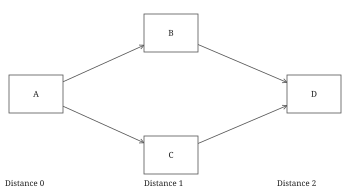
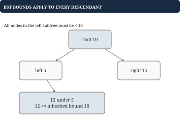
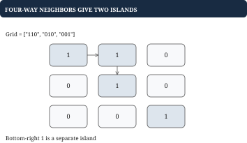

# Chapter 4 - Trees, graphs, and dependencies

A graph models relationships rather than just a sequence. This chapter asks three different questions: how far away is a vertex, which vertices are connected, and when is a dependent job ready? All use a frontier of pending work, but the rule for adding work determines the algorithm.

## Define vertices, edges, and the result

For recommendation links, a vertex is a title and an edge means a direct connection. For jobs, an edge from A to B means A must finish before B. For a grid, a vertex is a cell and edges join allowed neighboring cells. State whether edges are directed, weighted, or implicit.

The running graph is `edges = {A: [B, C], B: [D], C: [D], D: []}`. It has a shared descendant D. That is not a cycle: there is no path returning to its starting vertex.



An adjacency list uses O(V+E) space and lets a traversal inspect each vertex and edge once. A matrix uses O(V²) space but offers O(1) edge-existence checks. A grid already supplies its adjacency rules, so storing a separate edge object for every neighbor is unnecessary.

## Worked example: BFS gives shortest hop counts

**Problem.** Starting at A, return the minimum number of edges to each reachable vertex. The answer is `{A: 0, B: 1, C: 1, D: 2}`. All edges cost one hop.

A first-in-first-out queue processes distance 0, then distance 1, then distance 2. Mark a vertex when adding it, so two parents cannot enqueue it twice.

| Removed | New discoveries | Pending queue |
| --- | --- | --- |
| A | B:1, C:1 | `[B, C]` |
| B | D:2 | `[C, D]` |
| C | None; D is known | `[D]` |
| D | None | `[]` |

## Go example: record discovery on enqueue

```go
func HopDistances(edges map[string][]string,
    start string) map[string]int {
    distance := map[string]int{start: 0}
    queue := []string{start}
    for head := 0; head < len(queue); head++ {
        from := queue[head]
        for _, to := range edges[from] {
            if _, seen := distance[to]; seen {
                continue
            }
            distance[to] = distance[from] + 1
            queue = append(queue, to)
        }
    }
    return distance
}
```

The distance map also acts as the visited set. An unreachable vertex is absent; distance 0 belongs to the start. Missing adjacency entries mean no outgoing edges. Work is O(V+E) over reachable vertices, with O(V) additional space. Save a parent on first discovery if the requested output is the actual path, such as `[A, B, D]`.

BFS minimizes edge count, not arbitrary cost. A direct A-to-B edge of cost 10 loses to A-to-C-to-B with costs 1 and 1. For nonnegative weights, Dijkstra orders the frontier by tentative total cost in a min heap. It relaxes edges and skips stale heap distances. Negative weights invalidate its usual finalization argument.

## Trees: BFS can group by level

**Problem.** Return levels of a binary tree with root 10, children 5 and 15, and a right child 12 beneath 5. The level output is `[[10], [5, 15], [12]]` regardless of whether the tree is a valid search tree.

Capture queue length at the beginning of each level. Nodes appended during that level belong to the next one.

```go
type TreeNode struct {
    Value int
    Left, Right *TreeNode
}

func TreeLevels(root *TreeNode) [][]int {
    if root == nil {
        return nil
    }
    queue := []*TreeNode{root}
    var levels [][]int
    for head := 0; head < len(queue); {
        end := len(queue)
        var level []int
        for head < end {
            n := queue[head]
            head++
            level = append(level, n.Value)
            if n.Left != nil {
                queue = append(queue, n.Left)
            }
            if n.Right != nil {
                queue = append(queue, n.Right)
            }
        }
        levels = append(levels, level)
    }
    return levels
}
```

Each node enters once: O(n) time. This simple head-index queue retains O(n) references until completion. A compacting queue can reduce retained storage toward maximum level width, but is unnecessary for a small traversal. The input must be a tree; cycles need visited state.

## BST validation: local comparisons are insufficient

**Problem.** Is the same tree a binary search tree, with every left descendant smaller and every right descendant larger? The answer is false. The value 12 is greater than its parent 5, but belongs to the left subtree of 10 and must also be less than 10.



Inorder traversal visits left, node, right. A valid BST with no duplicates produces strictly increasing values. Keep both the previous value and a flag saying whether it exists; the smallest integer is a valid value, not a safe sentinel.

```go
func IsBST(root *TreeNode) bool {
    previous, havePrevious := 0, false
    var visit func(*TreeNode) bool
    visit = func(n *TreeNode) bool {
        if n == nil {
            return true
        }
        if !visit(n.Left) {
            return false
        }
        if havePrevious && n.Value <= previous {
            return false
        }
        previous, havePrevious = n.Value, true
        return visit(n.Right)
    }
    return visit(root)
}
```

The counterexample visits `[5, 12, 10, 15]`; 10 fails after 12. Time is O(n), recursion space O(h) for tree height h, possibly n in a chain. Passing inherited lower and upper bounds is an equivalent approach.

## Connected components: count islands with DFS

**Problem.** Count islands in `grid = ["110", "010", "001"]`, joining land only up, down, left, and right. The answer is 2. The final corner is diagonally adjacent but disconnected under this rule.



Scan every cell. Each unvisited land cell starts one new component; a stack explores and marks its entire component. This version mutates land `'1'` to water `'0'`, so callers needing preservation must copy each row first.

```go
func IslandCount(grid [][]byte) int {
    if len(grid) == 0 || len(grid[0]) == 0 {
        return 0
    }
    rows, cols := len(grid), len(grid[0])
    directions := [][2]int{{1, 0}, {-1, 0},
        {0, 1}, {0, -1}}
    count := 0
    for r := 0; r < rows; r++ {
        for c := 0; c < cols; c++ {
            if grid[r][c] != '1' {
                continue
            }
            count++
            grid[r][c] = '0'
            stack := [][2]int{{r, c}}
            for len(stack) > 0 {
                p := stack[len(stack)-1]
                stack = stack[:len(stack)-1]
                for _, d := range directions {
                    nr, nc := p[0]+d[0], p[1]+d[1]
                    if nr < 0 || nr >= rows ||
                        nc < 0 || nc >= cols ||
                        grid[nr][nc] != '1' {
                        continue
                    }
                    grid[nr][nc] = '0'
                    stack = append(stack, [2]int{nr, nc})
                }
            }
        }
    }
    return count
}
```

Assume a rectangular grid containing only '0' and '1'. Mark before pushing to avoid duplicate work. Each cell is visited once, so time is O(rows*cols); the stack can use O(rows*cols) space even though no separate visited array is allocated.

## Worked example: a dependency queue means ready, not nearby

**Problem.** Execute jobs with prerequisites `A -> B`, `A -> C`, `B -> D`, `C -> D`. D must wait for both B and C. A possible result is `[A, B, C, D]`.

Indegree counts unfinished prerequisites: `{A: 0, B: 1, C: 1, D: 2}`. The ready queue initially contains A. Completing B alone leaves D blocked with indegree 1.

| Completed | Updated prerequisite counts | Ready queue |
| --- | --- | --- |
| A | B:0, C:0, D:2 | `[B, C]` |
| B | D:1 | `[C]` |
| C | D:0 | `[D]` |
| D | All complete | `[]` |

## Putting the program together: topological ordering

This complete function uses integer job IDs `[0, n)`. Edges are `[prerequisite, dependent]`. Invalid IDs or cycles return false. Duplicate edges are counted and decremented consistently.

```go
func JobOrder(n int, edges [][2]int) ([]int, bool) {
    if n < 0 {
        return nil, false
    }
    next := make([][]int, n)
    pending := make([]int, n)
    for _, e := range edges {
        if e[0] < 0 || e[0] >= n ||
            e[1] < 0 || e[1] >= n {
            return nil, false
        }
        next[e[0]] = append(next[e[0]], e[1])
        pending[e[1]]++
    }
    var ready []int
    for id, count := range pending {
        if count == 0 {
            ready = append(ready, id)
        }
    }
    for head := 0; head < len(ready); head++ {
        for _, id := range next[ready[head]] {
            pending[id]--
            if pending[id] == 0 {
                ready = append(ready, id)
            }
        }
    }
    return ready, len(ready) == n
}
```

Isolated jobs are included by initialization. Add `D -> A` and the cycle blocks complete output. An empty final queue alone does not prove success; compare output count with n. Time and space are O(V+E). A smallest-ready-ID requirement needs a heap instead of the queue.

## Clone Graph: register identity before following cycles

**Problem.** Copy a graph without sharing its original nodes, preserving cycles and shared neighbors. Two distinct nodes may have the same label, so identity must use pointers rather than labels.

```go
type GraphNode struct {
    Label string
    Neighbors []*GraphNode
}

func CloneGraph(start *GraphNode) *GraphNode {
    copied := make(map[*GraphNode]*GraphNode)
    var clone func(*GraphNode) *GraphNode
    clone = func(n *GraphNode) *GraphNode {
        if n == nil {
            return nil
        }
        if copy, found := copied[n]; found {
            return copy
        }
        copy := &GraphNode{Label: n.Label}
        copied[n] = copy
        for _, neighbor := range n.Neighbors {
            copy.Neighbors = append(copy.Neighbors,
                clone(neighbor))
        }
        return copy
    }
    return clone(start)
}
```

For `A -> B -> A`, registering the copy of A before copying B lets B's back-edge reuse that copy. Late registration would recurse forever. Each reachable node is copied once, giving O(V+E) time and space. Discovery, readiness, and clone identity are distinct meanings of visited state; name the meaning your task needs.
