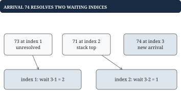
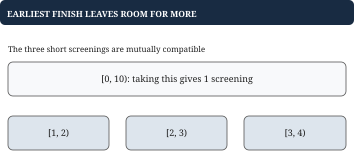
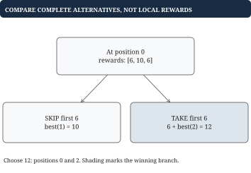

# Chapter 5 - Stacks, greedy choices, backtracking, and dynamic programming

Some problems ask you to match unfinished work; others ask you to choose a best combination. This chapter explains how to decide what state represents, whether a local choice is safe, and when different choice paths can reuse the same remaining answer.

## Matching brackets: unfinished work has a last-in-first-out order

**Problem.** Validate nesting in `"([])"`. It is valid. `"([)]"` is invalid even though opening and closing counts match. A closing bracket must match the most recent unfinished opener.

| Character in `"([])"` | Stack after action | Reason |
| --- | --- | --- |
| `(` | `['(']` | Wait for closing round bracket |
| `[` | `['(', '[']` | The square opener is now innermost |
| `]` | `['(']` | Match and pop square opener |
| `)` | `[]` | Match and pop round opener |

Stack cells contain the unmatched opening characters. The code below uses bytes and assumes the input contains only the six bracket characters. It rejects any other character.

## Go example: match the top before popping

```go
func Balanced(text string) bool {
	pairs := map[byte]byte{')': '(', ']': '[', '}': '{'}
	var stack []byte
	for i := 0; i < len(text); i++ {
		ch := text[i]
		if ch == '(' || ch == '[' || ch == '{' {
			stack = append(stack, ch)
			continue
		}
		opener, valid := pairs[ch]
		if !valid || len(stack) == 0 ||
			stack[len(stack)-1] != opener {
			return false
		}
		stack = stack[:len(stack)-1]
	}
	return len(stack) == 0
}
```

The stack is the exact sequence of unmatched openers. For `"([)]"`, ')' sees '[' at the top and immediately fails. An empty string is valid; a leading closer fails before indexing the stack. Each character is pushed or popped at most once: O(n) time and O(n) space.

## Monotonic stacks: wait for a greater value

**Problem.** For `load = [70, 73, 71, 74]`, return how many later positions you must wait for a strictly greater value: `[1, 2, 1, 0]`. Zero means no later greater value.

Store unresolved indices, keeping their values nonincreasing from bottom to top. Arrival 74 resolves index 2 (71), then index 1 (73). Index 0 (70) was already resolved by 73.



| Arrival | Unresolved indices | Newly known waits |
| --- | --- | --- |
| 70 at 0 | `[0]` | None |
| 73 at 1 | `[1]` | Index 0 waits 1 |
| 71 at 2 | `[1, 2]` | None |
| 74 at 3 | `[3]` | Index 2 waits 1; index 1 waits 2 |

```go
func GreaterWait(values []int) []int {
	waits := make([]int, len(values))
	var stack []int
	for i, value := range values {
		for len(stack) > 0 {
			j := stack[len(stack)-1]
			if value <= values[j] {
				break
			}
			stack = stack[:len(stack)-1]
			// This is the first later value greater than j's.
			waits[j] = i - j
		}
		stack = append(stack, i)
	}
	return waits
}
```

Why is this the first greater value? If a greater value had arrived earlier, it would already have popped that unresolved index. Equal values do not resolve a strictly-greater query. Every index is pushed once and popped at most once, so the nested loop still totals O(n) work, with O(n) storage. Sliding-window maximum additionally needs expiration from the oldest end, so it uses a monotonic deque rather than this stack.

## Greedy scheduling: the choice needs a proof

**Problem.** Select the largest number of nonoverlapping screenings from `[[0, 10], [1, 2], [2, 3], [3, 4]]`. Half-open intervals may touch. Choosing earliest start gives only `[0, 10]`; choosing earliest finish yields 3 short screenings.



Sort by finish and take each compatible interval. In any optimal solution, replacing its first interval with the earliest-finishing one cannot obstruct later intervals, because it finishes no later. Repeat this exchange argument on the remaining schedule.

```go
func MostScreenings(input [][2]int) [][2]int {
	a := append([][2]int(nil), input...)
	sort.Slice(a, func(i, j int) bool {
		if a[i][1] != a[j][1] {
			return a[i][1] < a[j][1]
		}
		return a[i][0] < a[j][0]
	})
	var chosen [][2]int
	end, haveEnd := 0, false
	for _, interval := range a {
		// Earliest finish leaves room for later screenings.
		if !haveEnd || interval[0] >= end {
			chosen = append(chosen, interval)
			end, haveEnd = interval[1], true
		}
	}
	return chosen
}
```

Assume valid intervals with start<end. The boolean allows negative timestamps instead of using 0 as an accidental lower bound. Sorting costs O(n log n), storage O(n) for the preserved copy and output. If screenings carry different rewards and the objective becomes maximum total reward, this greedy proof no longer establishes optimality.

## Backtracking: enumerate choices and undo each one

**Problem.** Choose exactly 2 titles within duration budget 5 from `duration = [2, 3, 4]`. Order does not matter. The only result is indices `[[0, 1]]`, totaling 5. The baseline is an explicit choice search, not a sorting trick.

A state contains the next available index, the chosen indices, and remaining budget. Use increasing indices to generate each combination once. After exploring a choice, remove it before exploring a sibling branch.

```go
func PlaylistChoices(duration []int,
	count, budget int) [][]int {
	if count < 0 || budget < 0 {
		return nil
	}
	var chosen []int
	var out [][]int
	var search func(int, int)
	search = func(start, remaining int) {
		if len(chosen) == count {
			// Later branches reuse chosen's backing array.
			snapshot := append([]int{}, chosen...)
			out = append(out, snapshot)
			return
		}
		needed := count - len(chosen)
		// Stop when too few titles remain to finish a choice.
		for i := start; i <= len(duration)-needed; i++ {
			if duration[i] > remaining {
				continue
			}
			chosen = append(chosen, i)
			search(i+1, remaining-duration[i])
			// Undo this choice before exploring its sibling.
			chosen = chosen[:len(chosen)-1]
		}
	}
	search(0, budget)
	return out
}
```

This assumes nonnegative durations; pruning an over-budget choice is unsafe if later negative contributions could repair it. The loop also stops when fewer than the needed number of titles remain. Copy each completed result because later mutations reuse chosen's backing array. Search can be exponential, and output can itself be exponential. Auxiliary recursion/path space is O(n), excluding saved answers.

A permutation problem would have a different contract: increasing indices would incorrectly discard different orders. A director restriction would need director state; index and budget alone would forget a constraint.

## Worked example: derive a DP state from take or skip

**Problem.** Rewards `reward = [6, 10, 6]` occupy neighboring promotion slots. Select nonadjacent slots for maximum total; choosing nothing is allowed. The answer is 12 from indices `[0, 2]`. Greedily choosing the largest reward gives 10 and fails.

Define `best[i]` as the maximum reward using positions i onward. At i, either skip and obtain `best[i+1]`, or take and obtain `reward[i] + best[i+2]`. These are the complete legal choices. Beyond the array, best is 0.



| i, evaluated backward | Skip | Take | best[i] |
| --- | --- | --- | --- |
| 2 | 0 | `6+0 = 6` | 6 |
| 1 | 6 | `10+0 = 10` | 10 |
| 0 | 10 | `6+6 = 12` | 12 |

A naive recursion reaches the same suffix through several decision paths. Memoization computes each suffix once; a backward loop does so directly. The state is sufficient because earlier choices impose no remaining condition after a legal entry to that suffix.

## Putting the program together: two rolling suffix answers

```go
func BestNonAdjacent(reward []int64) int64 {
	var next, afterNext int64
	for i := len(reward) - 1; i >= 0; i-- {
		// next is best[i+1]; afterNext is best[i+2].
		take := reward[i] + afterNext
		current := next
		if take > current {
			current = take
		}
		afterNext = next
		next = current
	}
	return next
}
```

At iteration i, next means `best[i+1]` and afterNext means `best[i+2]`. Save the old next into afterNext before replacing next. Empty and all-negative inputs return 0 under the empty-selection contract. Time is O(n), space O(1); all sums must fit int64.

## Worked example: value output and reconstructed output need different state

For `[4, 1, 1, 4]`, the full suffix table is `[8, 5, 4, 4, 0, 0]`. At index 0, taking gives `4 + best[2] = 8`, better than skipping's 5. Jump to index 2: skip its 1 because best[3]=4 is better than `1+best[4]=1`. Take index 3. Output indices are `[0, 3]`.

The rolling implementation returns 8 but deliberately discards the decisions needed to recover `[0, 3]`. Retain a table or decisions when the output requires them. Adding a selection limit or budget similarly expands the DP state. Count states times work per state; an O(nB) budget table depends on the numeric budget B and is pseudopolynomial.

Greedy discards choices using a proof; backtracking explores distinct choices; DP shares equivalent remaining problems. A tiny counterexample and an explicit state definition are more useful than guessing a technique from the story.
