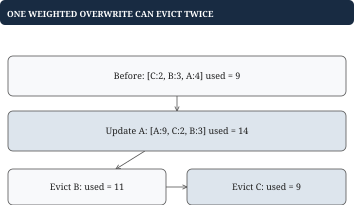

# Chapter 6 - LRU and weighted caches

A cache avoids repeating expensive work, such as fetching movie metadata. Memory is limited, so it needs an eviction policy. This chapter implements least recently used eviction and then changes capacity from number of entries to total weight.

## Define the observable cache behavior

**Problem.** Support `Put(key, value)` and `Get(key)` with capacity 2. A successful read or write makes its key most recent. When insertion exceeds capacity, remove the least recent resident. A missing read changes nothing. Zero is a valid value, and zero capacity stores nothing.

LRU means least recently used, not least frequently used. Many accesses yesterday do not outrank one access now. It favors temporal locality; a scan of unique keys can still displace useful residents.

## Worked example: make recency visible

Order below runs from most recent to least recent:

| Operation | Resident order | Result |
| --- | --- | --- |
| `Put("A", 4)` | `[A]` | Insert A |
| `Put("B", 7)` | `[B, A]` | Cache full |
| `Get("A")` | `[A, B]` | Return `(4, true)` |
| `Put("C", 9)` | `[C, A]` | Evict B |
| `Put("A", 0)` | `[A, C]` | Update existing A |

A map finds A quickly but supplies no meaningful recency order. A list supplies oldest and newest positions but cannot find an arbitrary key quickly. Use `map[key]*node` plus a doubly linked list. The map points to the same node even when that node moves.

![The map finds A's stable node. Promotion changes list order from [B, A] to [A, B].](figures/lru.svg)

## Go example: define nodes and an initialized cache

Head and tail are empty sentinel nodes outside the map and capacity. Even an empty list has `head.next = tail` and `tail.prev = head`. That makes endpoint mutations use the same rules as middle mutations.

```go
type cacheNode struct {
    key string
    value int
    prev, next *cacheNode
}

type ReadCache struct {
    byKey map[string]*cacheNode
    head, tail *cacheNode
    capacity int
}

func NewReadCache(capacity int) *ReadCache {
    if capacity < 0 {
        capacity = 0
    }
    head, tail := &cacheNode{}, &cacheNode{}
    head.next, tail.prev = tail, head
    return &ReadCache{
        byKey: make(map[string]*cacheNode),
        head: head, tail: tail, capacity: capacity,
    }
}
```

This constructor clamps negative capacity to zero. A stricter API could return an error instead. Use the constructor: a zero-valued ReadCache has no linked sentinels and is not initialized.

Three invariants connect the structures: every real node has one map entry; every map entry points to that real node; neighboring forward and backward links agree. Completed operations also satisfy resident count<=capacity.

## Pointer helpers: detach, then insert

Detach joins a known node's neighbors. InsertFront places a detached node between head and the old first node. Because the map found the node and each node has both neighbors, neither operation searches the list.

```go
func detach(n *cacheNode) {
    n.prev.next = n.next
    n.next.prev = n.prev
    n.prev, n.next = nil, nil
}

func insertFront(head, n *cacheNode) {
    first := head.next
    n.prev, n.next = head, first
    head.next = n
    first.prev = n
}

func (c *ReadCache) remove(n *cacheNode) {
    detach(n)
    delete(c.byKey, n.key)
}
```

For `head-B-A-tail`, detaching A connects B directly to tail. Inserting A at the front gives `head-A-B-tail`. The arrows in the figure stand for both directions; each assignment repairs one link. Never detach a sentinel or an already detached node.

Removal must update the map as well as the list. Leaving B's map entry after eviction would permit reads of an evicted value and later pointer corruption. Centralizing removal makes that joint mutation explicit.

## Putting the program together: Get and Put

Get is lookup, promote, return. A miss performs no pointer edits.

```go
func (c *ReadCache) Get(key string) (int, bool) {
    n, found := c.byKey[key]
    if !found {
        return 0, false
    }
    detach(n)
    insertFront(c.head, n)
    return n.value, true
}
```

Put updates an existing node or adds one new node. Count-limited insertion can exceed capacity by only one, so one eviction is sufficient.

```go
func (c *ReadCache) Put(key string, value int) {
    if c.capacity == 0 {
        return
    }
    if n, found := c.byKey[key]; found {
        n.value = value
        detach(n)
        insertFront(c.head, n)
        return
    }
    n := &cacheNode{key: key, value: value}
    c.byKey[key] = n
    insertFront(c.head, n)
    if len(c.byKey) > c.capacity {
        c.remove(c.tail.prev)
    }
}
```

Get A after the final table row returns `(0, true)`; Get B returns `(0, false)`. A repeated Put must not allocate a second A node. Both methods take expected O(1) time for bounded-size keys and values, with O(capacity) resident space. They are single-threaded; chapter 7 protects whole operations when concurrency is added.

## Weighted capacity: number of entries is no longer the budget

**Problem.** Each entry has a positive weight, such as charged payload bytes. Total resident weight must stay at or below budget 10. Reject an item larger than the whole budget, leaving an old value and recency unchanged. Reject nonpositive weights in this variant.

Keep `used = sum(weights of residents)`. An overwrite subtracts its old charge before adding the new one. Eviction repeatedly removes the least recent entry until used<=budget. A byte-only policy must also account for actual node/map overhead if it promises a process-memory bound.



## Worked example: one overwrite can require several victims

Initial order is `[C, B, A]`, weights `{C: 2, B: 3, A: 4}`, used=9. Overwrite A with weight 9: `used = 9-4+9 = 14`, order `[A, C, B]`. Removing B leaves 11, still over budget; removing C leaves 9.

| Transition | Recency | Total weight |
| --- | --- | --- |
| Initial | `[C, B, A]` | 9 |
| Update A to 9 | `[A, C, B]` | 14 |
| Evict B | `[A, C]` | 11 |
| Evict C | `[A]` | 9 |

If proposed weight were 11, reject before any mutation. The original `[C, B, A]` and used=9 survive. Input validation must precede destructive eviction.

## Go example: weighted admission and shared removal

This extension reuses the node/list helpers, while maintaining its own weight accounting. It deliberately bypasses count-limited Put, because that method cannot update the weight map on its own.

```go
type WeightedCache struct {
    list *ReadCache
    weights map[string]int
    used, budget int
}

func NewWeightedCache(budget int) *WeightedCache {
    if budget < 0 {
        budget = 0
    }
    return &WeightedCache{
        list: NewReadCache(0),
        weights: make(map[string]int), budget: budget,
    }
}

func (w *WeightedCache) Get(key string) (int, bool) {
    return w.list.Get(key)
}
```

The following Put returns whether admission succeeded. Weights and their intermediate total must fit int.

```go
func (w *WeightedCache) Put(key string,
    value, weight int) bool {
    if weight <= 0 || weight > w.budget {
        return false
    }
    c := w.list
    n, found := c.byKey[key]
    if found {
        w.used -= w.weights[key]
        detach(n)
    } else {
        n = &cacheNode{key: key}
        c.byKey[key] = n
    }
    n.value = value
    insertFront(c.head, n)
    w.weights[key] = weight
    w.used += weight
    for w.used > w.budget {
        victim := c.tail.prev
        w.used -= w.weights[victim.key]
        delete(w.weights, victim.key)
        c.remove(victim)
    }
    return true
}
```

The new node is most recent and individually fits the budget, so removing older residents eventually restores the invariant without needing to reject the admitted value. A Put evicting r residents costs O(1+r), not worst-case O(1). Get remains expected O(1). Positive weights bound the number of residents by the numeric budget; payload bytes alone still omit allocation overhead.

The central lesson is joint state: identity, recency, and total charge describe the same residents. Every branch that changes membership must update all affected views together.
