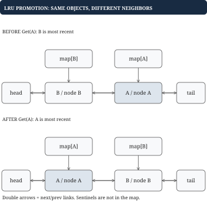

# Chapter 6 — LRU and weighted caches

A cache exercise is about coordinating identity, order, and capacity without letting those views disagree.

## Begin with a contract small enough to implement

Our first cache stores string keys and integer values. Get returns a value and a found flag. Put inserts or overwrites. Successful Get and Put both make the entry most recently used. The capacity is the maximum number of entries. Zero capacity stores nothing. A missing Get does not change order. Expiration and concurrency are separate follow-ups.

LRU means least recently used. It is not least frequently used. A title accessed a thousand times yesterday can be evicted before one accessed once just now. This policy is a useful heuristic for temporal locality, not a guarantee that the most popular items survive. A one-time scan of many unique items can displace frequently reused entries.

## Derive the two structures

A map locates a value by key quickly but does not identify the least recently used key. A list ordered by recency identifies the oldest entry quickly but cannot locate an arbitrary key quickly. Combine them: map each key to a node in a doubly linked list. Keep the most recent node at the front and least recent at the back. Each node has its key, value, previous pointer, and next pointer.

Why doubly linked? Removing a known node requires access to both neighbors. With only a next pointer, you would generally have to search for the predecessor. With both pointers, detach by joining the neighbors, then insert at the front. Sentinel head and tail nodes make empty-list and endpoint operations follow the same pointer rules.

There are three core invariants. Every map entry points to exactly one real list node. Every real list node has exactly one map entry under its key. Neighbor pointers agree, and the real-node count never exceeds capacity when a public operation returns. Express these before coding; they tell you what every helper must preserve.

## Following the recency state

With capacity two, Put A then Put B gives recency order B, A, listed from most recent to least recent. Get A detaches A and moves it to the front, giving A, B. Put C inserts C, temporarily giving C, A, B. Capacity is exceeded, so evict B from the tail and delete B from the map. Overwrite A with a new value: update the existing node and promote it, giving A, C. Do not create a second A node.

**Failure case.** Removing a cache node from the list without deleting its map entry breaks membership consistency.

The map can return an evicted value and may attempt to detach a node that is no longer linked, corrupting the list. The map-to-list correspondence fails immediately at eviction, before any later lookup. Test internal invariants after operations, not only returned values.

## Implement the helpers before the policy

Write detach, insert-at-front, and remove. Detach updates only list links. Insert-at-front links an already detached node. Remove detaches and deletes from the map. Get then becomes lookup, promote, return. Put becomes update and promote, or allocate and insert, followed by eviction when necessary. Avoid duplicating pointer manipulation in every branch.

Expected Get and Put time is constant for a count-limited cache, assuming fixed-cost keys and values. Space is linear in capacity, including map entries and list nodes. Go's built-in container/list can be appropriate in ordinary code, but your plan specifically calls for implementing the linked list yourself; the provided reference `LRU` does that.

## Weighted capacity changes the accounting

Now each entry has a weight, such as payload bytes. Maintain total weight as an invariant equal to the sum of resident entry weights. On overwrite subtract the old weight and add the new weight. Then evict from the back repeatedly while over budget. One Put can evict many items, so worst-case time is linear in the number of entries removed, not constant. Across an operation sequence, each inserted node can be evicted only after being inserted, which helps amortized analysis.

Choose an oversized-item policy explicitly. In this course, reject a weight greater than the entire budget and leave an existing value under that key unchanged. Check this before mutating. Another reasonable contract removes the old entry but refuses the new one; it must be stated and tested. Negative weights are invalid. Zero-weight entries can defeat a byte-only entry bound, so either disallow them, charge overhead, or use a second count limit.

Suppose budget is ten. Put A weight four, B weight four; Get A; Put C weight five. Before eviction, weight is thirteen and order is C, A, B. Evict B to reach nine. If C instead weighs eleven, reject it before touching A or B. A byte budget for values alone does not bound actual process memory: maps, nodes, allocator overhead, and stale heap records also consume space.

## Build the cache from the two questions it must answer

Before imagining pointers, imagine two separate conversations with the cache. A caller asks, “Do you have movie A?” Capacity management asks, “Which resident movie has gone longest without being used?” The first question is about identity; the second is about order. A map answers identity but has no meaningful recency order. A recency list answers oldest and newest but cannot immediately find an arbitrary movie. The combined solution is a small example of maintaining multiple indexes over the same objects.

Now imagine a node as a card containing a key and value, with a connection to the card before it and the card after it. The map does not need another copy of the value; it can identify the card directly. When the card moves, its identity remains the same, so the map continues to point to it. Moving a value inside a slice, by contrast, can change positional indexes. A stable node reference lets identity and position vary independently.

Detaching a card means making its two neighbors point to each other. Inserting it at the front means placing it between the head marker and the previous first card. You do not search through the list during either operation because the map already found the card and the card knows its neighbors. That is the actual reason promotion is constant time. A linked list without fast key lookup would still require a search; a key map without backward links would not immediately provide the predecessor needed for removal.

Sentinel nodes are deliberately empty boundary markers. An empty list consists of head connected to tail. The first insertion uses the same “insert between two neighbors” rule as later insertions. They reduce exceptional pointer cases; they do not count toward capacity or belong in the key map. A useful invariant is: every real card is reachable exactly once between the markers and is named exactly once by the map.

Weighted capacity adds another view: the total charge for all resident cards. That number is a cached summary of the list contents. If you overwrite an entry, you must remove the old charge before adding the new one. If you evict several entries, subtract each exactly once. This is not merely arithmetic bookkeeping; it is an invariant connecting state representations. The same style of reasoning later governs streaming sums when events expire.

## Worked example: the map finds the node; the list moves it

Take a capacity-two cache with recency order B, A. A successful Get for A must find A and move it in front of B. A map supplies a reference to A's existing node. The list supplies its neighbors. Moving the node does not change the map reference, because the object is the same even though its position changes.



| Operation | Most recent to least recent | Map keys | Result |
| --- | --- | --- | --- |
| Put A=4 | A | A | One resident |
| Put B=7 | B, A | A, B | Full |
| Get A | A, B | A, B | Return 4 |
| Put C=9 | C, A | A, C | Evict B |
| Put A=0 | A, C | A, C | Update existing node |

The zero in the final row is a legitimate cached value. A later Get A returns zero and found true; a Get B returns found false. The map's presence information must not be replaced by a value sentinel.

During a move, think of the pointers as two separate local edits. First join A's old predecessor and successor. Then insert A between the head sentinel and the old first real node, repairing both directions. The helpers can temporarily leave A detached, but a completed public operation must restore one map entry per real list node and matching forward and backward links. Testing only returned values can miss an internal violation until much later.

## Worked example: an overwrite can trigger several evictions

Use a byte budget of ten and recency order C, B, A with weights two, three, and four. Total weight is nine. Overwrite A with weight eight. Rejecting an item larger than the entire budget does not apply: eight is admissible. Subtract A's old weight and add its new weight, bringing the total to thirteen; promote A to produce A, C, B.

Evict B, the least recent entry, subtracting three. Total becomes ten, so C survives. If A's new weight were nine, total after the overwrite would be fourteen. Removing B would leave eleven, requiring C to leave as well; only A would remain at weight nine. A single overwrite can therefore have work proportional to several victims.

If A's proposed weight were eleven, the chosen policy rejects the overwrite before any mutation. The old A remains at weight four, the order stays C, B, A, and total remains nine. This failure case explains why input validation belongs before eviction and why a policy must specify what happens to an existing value when its replacement cannot fit.

The recurring design pattern is a shared identity with multiple maintained views. The map, list, and total-weight counter describe the same residents. Every mutating branch must update all affected views together.

## Putting the program together: an LRU cache step by step

The public methods are Get and Put, with a nonnegative entry capacity. Get returns a value and found flag; a hit updates recency. Put overwrites or inserts and also updates recency. Zero capacity retains nothing. The cache struct contains capacity, a map from key to node, and head and tail sentinel nodes. Each real node contains key, value, previous node, and next node.

Define three helpers. Detach joins a node's two neighbors and clears its own links. InsertFront places a detached node between head and the current first node, repairing both directions. Remove calls Detach and deletes the key from the map. Helpers have preconditions: do not detach a sentinel or a node that is not linked, and do not insert a node that is still linked elsewhere.

Get looks up the key. A miss returns missing without mutation. A hit detaches the node, inserts it at the front, and returns its value. Put first handles zero capacity. If the key exists, update that node's value, promote it, and return. Otherwise allocate a node, register it in the map, and insert it at the front. If capacity is exceeded, remove the node immediately before tail.

For capacity two, Put A then B produces B, A. Get A produces A, B. Put C produces C, A after evicting B. Overwrite A with value zero produces A, C; Get A must return zero with found true. This last observation tests the absence representation independently of the ordering.

The public methods preserve one-to-one map/list membership and valid neighboring links. Every operation has expected constant work under the count capacity. If concurrency is added, protect the entire public transition with one mutex first; Get requires the exclusive lock because promotion mutates links. Do not separately lock each helper in a way that leaves inconsistent intermediate states visible or recursively reacquires the same mutex.

## Go example: move a known node with local pointer edits

These are complete list helpers and a cache Get method, not the full cache. The constructor must allocate an empty key map and connect head.next to tail and tail.prev to head. Head and tail are sentinels outside the key map. Put and eviction follow the program design above. No concurrent callers are assumed.

```go
type cacheNode struct {
    key string
    value int
    prev, next *cacheNode
}

type ReadCache struct {
    byKey map[string]*cacheNode
    head, tail *cacheNode
}

func detach(n *cacheNode) {
    n.prev.next = n.next
    n.next.prev = n.prev
    n.prev, n.next = nil, nil
}

func insertFront(head, n *cacheNode) {
    first := head.next
    n.prev, n.next = head, first
    head.next = n
    first.prev = n
}
```

Detach assumes a linked real node. InsertFront assumes a detached node and a valid sentinel head. Those preconditions let each helper avoid unnecessary boundary branches. Neither helper changes the key map: promotion moves the same object rather than replacing its identity.

```go
func (c *ReadCache) Get(key string) (int, bool) {
    n, found := c.byKey[key]
    if !found {
        return 0, false
    }
    detach(n)
    insertFront(c.head, n)
    return n.value, true
}
```

With B followed by A, Get A joins B to tail, then inserts A between head and B. The map continues to point to the same A node. Getting the already-first node is also safe: detach and reinsert restore its position. A missing key takes no pointer path. Count the assignments rather than the list length to see why a hit does constant list work. If concurrency is added, the lock must cover the entire Get transition, including both helpers.
