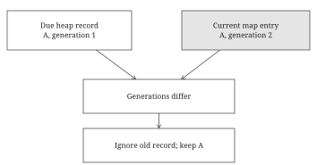

# Chapter 7 — Expiration clocks and concurrency

Time introduces a second order. Concurrency makes a sequence of correct individual steps unsafe unless they form one protected operation.

## Expiration is a behavioral rule first

For our TTL cache, Put at time t with positive lifetime d stores an absolute deadline t plus d. Get at time now returns a value only when now is strictly before the deadline. At the deadline it is expired. A nonpositive lifetime removes the key immediately. Updating resets the lifetime. A Get does not extend it. These choices distinguish expire-after-write from expire-after-access.

Use an injected clock so tests control now directly. The learning code uses int64 ticks in one agreed unit and assumes monotone time and no arithmetic overflow. In a real Go process, a clock returning time.Time can preserve monotonic elapsed-time behavior; persisted timestamps need different care. The important point is to make the source and meaning of time explicit, and never rely on real sleeping in unit tests. [Go time documentation](https://pkg.go.dev/time#hdr-Monotonic_Clocks).

A map with per-entry deadlines gives expected constant-time lookup. On Get, delete an expired entry and return missing. This is lazy expiration: it prevents stale reads, but an entry never read again may remain allocated indefinitely. Correct visibility and prompt memory reclamation are different requirements. Start with the simple version, then explain the gap honestly.

## Choose cleanup by the required order

A periodic scan checks every entry in linear time per sweep. It is simple and may be sufficient. A min heap of deadlines makes the next expiry easy to find. Repeatedly pop while the smallest deadline is at or before now. Removing r records costs O(r log h) where h is heap size. A queue only works if expiry order matches insertion order, such as a uniform TTL with monotone writes. Different TTLs break that assumption.

On each Put, store the current value, deadline, and a new generation number in the map; push deadline, key, generation into the heap. On cleanup, delete the map entry only if its generation still matches the popped record. This prevents an old timer from deleting a newer value. Assign generations from a globally increasing sequence, or otherwise avoid reusing an old generation after a key is deleted and recreated.

Trace A written at time zero, expiring at ten, generation one. At time five, overwrite A to expire at thirty, generation two. At time ten, the old heap record is ready. The map holds generation two, so discard the record without deleting A. The same defense applies to cancelled or rescheduled tasks. Reference: `TTLCache`.

**Failure case.** Two different writes of the same key can share a deadline, so a deadline alone need not identify a write.

The same key can identify multiple lifetimes. Equal deadlines may be reused, and future changes can make deadline-only identity fragile. A unique generation identifies the particular write, so cleanup can prove it is acting on the current lifetime.

Lazy invalidation simplifies updates but can accumulate stale heap records. Ten million rewrites of one key can produce ten million heap entries despite a one-entry map. Bound this by using an indexed heap with one live record per key, or periodically rebuild from live entries when stale overhead crosses a threshold. Rebuilding with heap.Init is linear in live entries, but creates a latency spike. “O(number of keys) memory” is not true for an unbounded lazy heap.

## Combining TTL and LRU

The map still answers identity. The linked list answers least recently used. The deadline heap answers earliest expiration. These are independent orders. An expired node can be at the front of the recency list, so removing only expired nodes at the tail does not clean all expired entries.

Choose whether capacity counts all physically stored entries or only unexpired ones. For “evict expired entries before live ones,” a straightforward Put first drains all due expirations, then updates or inserts, then evicts LRU entries if capacity is exceeded. That Put is not constant time when many items expire together. Get can remain approximately constant time by checking only its own key and leaving global cleanup elsewhere.

Removal must consistently update the map, recency list, and weight counter if present. Heap records may remain as harmless stale versions under lazy invalidation. Reuse a central remove helper rather than implementing three subtly different removal paths for eviction, expiration, and explicit deletion.

In your plan's capacity-three example, assume all actions occur before any deadline: Put A, Put B, Get A, Put C, Put D leaves D, C, A and evicts B. If A expires before D is inserted and cleanup removes expired entries first, A leaves and B can remain. Without specified elapsed time and cleanup policy, the original trace has no unique answer. Noticing that ambiguity is part of the skill.

## Thread safety protects the whole invariant

For a first concurrent implementation, put one mutex around each public operation that touches shared state. A successful LRU Get mutates the list, so it needs an exclusive lock. A TTL Get may delete an expired entry, so it is not automatically a read-only operation either. Protecting the map alone while updating pointers outside the lock leaves races and structural corruption.

Do not copy a cache containing a used mutex. Return pointers from constructors and use pointer receivers. Do not try to upgrade an RWMutex read lock into a write lock. A specialized concurrent map would protect only map operations, not the combined map/list/weight invariant. These synchronization rules are grounded in the [Go sync documentation](https://pkg.go.dev/sync) and [memory model](https://go.dev/ref/mem).

Slow loading introduces another concern. Holding the global cache mutex while calling a metadata service blocks unrelated keys. Instead check the cache, coordinate a per-key in-flight call, release the lock, load, then publish the result and wake waiters. Exactly one leader loads a key; other callers wait on that call's completion. Clear the in-flight record on failure as well as success. Decide whether failures are cached, whether stale values may be served, and how cancellations affect shared work.

Single-flight loading prevents duplicate simultaneous work; it does not enforce TTL or capacity. If a key is invalidated while loading, decide whether the late result may repopulate it. An invalidation generation can prevent that. With sharding, locks can reduce contention, but a globally exact LRU order becomes harder; mention the trade-off rather than claiming sharding preserves every property for free.

## Separate freshness, storage, and coordination

Three questions often get bundled together in a cache prompt. Is this value fresh enough to return? Is this entry still taking space? Is another caller already fetching its replacement? TTL answers the first question, cleanup answers the second, and in-flight coordination answers the third. A correct answer to one does not automatically answer the others. An entry can be expired but allocated, and a missing entry can have a fetch already underway.

Use a bookstore analogy carefully. An edition can become outdated at a known time even while its book remains on the shelf. A customer asking for that book must not be handed it as current. Removing it from the shelf can happen during that request or in a separate cleanup pass. Ordering shelves by most recent customer use does not order books by when their editions expire. That is why recency and deadline often require separate structures.

Now consider an expiry message as a delayed instruction: “Delete A at time ten.” If A is replaced before time ten, the instruction lacks enough identity. It should say, “Delete the particular lifetime of A that I was created for.” A generation number provides that identity. Cleanup looks at the current generation and acts only if it matches. This prevents stale work from affecting newer state. The principle applies to rescheduled tasks, cancelled requests, and late background computations.

Concurrency creates an analogous problem in the present rather than the future. Two requests can observe the same apparently available capacity before either records its own change. Each individual read and write may be safe, but their combined decision is not atomic. You need a single protected transition from the old valid state to the new valid state. For a cache, that transition can involve map, list, counters, and deadlines together.

Think about the exact moment at which an operation takes effect. In a simple locked cache, it occurs within the critical section while other callers cannot interleave. If you release the lock halfway through promotion, another operation can see a state that is neither the old order nor the new order. Locks are therefore protecting a semantic invariant, not merely preventing a runtime complaint about concurrent maps.

## Worked example: an old deadline is not permission to delete

At time zero, store A with deadline five and generation one. At time three, overwrite A with a new value, deadline ten, and generation two. The current map holds only generation two, while a lazy deadline heap can still contain both records. This is intentional: removing arbitrary old heap records immediately would need more indexing.

| Time | Action | Current A | Heap effect |
| --- | --- | --- | --- |
| 0 | Initial write | Generation 1, due 5 | Push (5, A, 1) |
| 3 | Refresh | Generation 2, due 10 | Push (10, A, 2) |
| 5 | Cleanup | Generation 2 survives | Pop and ignore generation 1 |
| 10 | Get A | Missing | Remove current entry |

At time five, checking only the key would wrongly delete the replacement. Comparing the deadline happens to distinguish these two records, but two writes can intentionally share a deadline. The generation identifies the write even then. Deleting A and later reinserting it must also assign a fresh generation rather than restarting a per-entry counter at one.

After the Get at time ten, a heap record may remain for a now-absent key. Later cleanup ignores it. The essential rule is that stale records cannot act on newer state. Space analysis must include those records; repeatedly refreshing one resident key can grow the heap far beyond the resident count unless cleanup or rebuilding bounds it.

## Worked example: individually safe operations can form an unsafe sequence

Suppose a deduplication wrapper has a thread-safe Get and a thread-safe Put. Worker one calls Get X and sees missing. Worker two calls Get X and sees missing. Both process the event, then both call Put X. No data race is necessary for this logical failure. Each method can be protected correctly while the combined decision is not atomic.

| Step | Worker one | Worker two |
| --- | --- | --- |
| 1 | Looks up X: missing | Waiting |
| 2 | Paused | Looks up X: missing |
| 3 | Processes X | Processes X |
| 4 | Stores X | Stores X |

An atomic claim operation combines checking absence and recording ownership under one lock. Only the worker that creates the claim proceeds. That fixes competing admission, but it introduces a new failure question: if the winner crashes after claiming, should another worker retry? A lease can allow a later retry, while an idempotent effect can make repeated execution tolerable. Neither follows automatically from a mutex.

For a cache miss that triggers a slow load, the corresponding pattern is per-key in-flight work. Under a short lock, create or join the work record. Release the lock during the network call. Publish success or failure and release all waiters afterward. The design has to cover the failure branch as carefully as the successful return.

## Putting the program together: TTL storage with safe cleanup

Expose Put(key, value, lifetime), Get(key), and Cleanup. A clock is supplied to the constructor. The store owns a map of current entries, a min heap of expiry records, and a generation sequence. Each current entry contains value, deadline, and generation. Each heap record contains key, deadline, and generation. Time units are consistent, deadlines fit the numeric type, and generation identities are not reused during relevant lifetimes.

Put with a nonpositive lifetime removes the current map entry. Otherwise it reads the clock, computes the deadline, allocates a fresh generation, stores the current entry, and pushes an expiry record. An older record for that key can remain in the heap. Get returns missing if absent. If the clock is at or past the current deadline, it deletes the map entry and returns missing. Otherwise it returns the value. Get does not drain the whole heap.

Cleanup reads now once for its cutoff. While the heap root is due, pop it. Look up its key in the current map. If absent, do nothing further. If present with a different generation, discard this stale record. Only a matching current generation may be deleted. A returned removal count can count current entries actually removed, rather than all stale heap records examined.

Write A at zero with deadline ten. At five, overwrite it with deadline thirty and a new generation. Cleanup at ten pops the old record but leaves the map unchanged. Cleanup at thirty removes the new entry. Deleting and recreating A between those calls is safe only if recreation does not reuse the old generation.

Put costs logarithmic time in heap size; Get is expected constant time; Cleanup costs according to the number of records popped. Heap size includes stale records, so repeated overwrites can grow memory. An indexed heap or periodic rebuilding addresses that extension. Adding a single mutex around public operations protects state, provided the injected clock is safe and does not reenter this cache.
