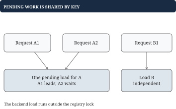

# Chapter 7 - Expiration, clocks, and concurrency

An LRU cache limits space but says nothing about freshness. Movie metadata can become stale while remaining popular. This chapter gives each write a lifetime, orders cleanup by deadlines, and protects multi-step mutations when several callers share the cache.

## TTL: define exactly when a value becomes unavailable

**Problem.** Store `Put("A", "HD", ttl=5)` at time 0. A read at time 4 returns HD; a read at time 5 returns missing. TTL means time to live. Our deadline is `writeTime + ttl`, and a value is live only when `now < deadline`.

Overwriting resets the lifetime; reading does not extend it. Nonpositive TTL removes the key. The clock is injected, is non-nil, uses one agreed integer tick unit, and never goes backward. Deadline arithmetic and generation numbers must not overflow.

| Time | Operation | Result |
| --- | --- | --- |
| 0 | Put A with TTL 5 | Deadline 5 |
| 4 | Get A | `("HD", true)` |
| 5 | Get A | `("", false)`; remove A |

This is expire-after-write. Expire-after-access is a different contract and would change deadlines on reads. Tests can set an injected clock to 4 or 5 directly, with no sleeping.

## Go example: a map handles fresh visibility

Each current entry carries its value, absolute deadline, and write generation. A generation identifies one lifetime of one key, so delayed cleanup cannot confuse it with a replacement.

```go
type TimedValue struct {
	Value      string
	Deadline   int64
	Generation uint64
}

type Expiry struct {
	Key        string
	Deadline   int64
	Generation uint64
}

type TTLMap struct {
	current map[string]TimedValue
	due     ExpiryHeap
	next    uint64
	clock   func() int64
}

func NewTTLMap(clock func() int64) *TTLMap {
	return &TTLMap{
		current: make(map[string]TimedValue),
		clock:   clock,
	}
}
```

ExpiryHeap is the min heap defined below. Heap storage is separate from current entries; it may retain records for earlier lifetimes.

```go
func (c *TTLMap) Put(key, value string, ttl int64) {
	if ttl <= 0 {
		delete(c.current, key)
		return
	}
	deadline := c.clock() + ttl
	// A new generation distinguishes refreshes and reinserts.
	c.next++
	c.current[key] = TimedValue{
		Value: value, Deadline: deadline,
		Generation: c.next,
	}
	heap.Push(&c.due, Expiry{
		Key: key, Deadline: deadline, Generation: c.next,
	})
}

func (c *TTLMap) Get(key string) (string, bool) {
	entry, found := c.current[key]
	if !found {
		return "", false
	}
	if c.clock() >= entry.Deadline {
		delete(c.current, key)
		return "", false
	}
	return entry.Value, true
}
```

Get checks only its own key and takes expected O(1). Deleting on read is lazy expiration. It prevents stale reads but cannot reclaim an expired entry that nobody reads. Fresh visibility and prompt memory cleanup are separate requirements.

## Cleanup needs deadline order, not insertion order

Write A at time 0 with TTL 100, then B at time 1 with TTL 2. Deadlines are `{A: 100, B: 3}`. A FIFO queue would see fresh A first and could leave expired B behind it. A deadline min heap exposes B first.

![Insertion order [A, B] differs from deadline order [B, A]. Varying TTLs need a deadline index.](figures/deadline-order.svg)

| Cleanup choice | Work | Assumption or trade-off |
| --- | --- | --- |
| Check on Get | Expected O(1) | Unread expired entries can remain |
| Periodic map scan | O(n) per scan | Simple; scan latency grows with residents |
| Deadline min heap | O(log h) per record removed | h includes stale records |
| FIFO deadline queue | Amortized O(1) | Deadlines must follow insertion order |

The Go standard heap package supplies swaps and repairs through an interface. The receiver's Pop removes the final slice element; `heap.Pop` first moves the minimum there. Calling the receiver's Pop directly would not mean remove-minimum.

```go
type ExpiryHeap []Expiry

func (h ExpiryHeap) Len() int { return len(h) }
func (h ExpiryHeap) Less(i, j int) bool {
	return h[i].Deadline < h[j].Deadline
}
func (h ExpiryHeap) Swap(i, j int) {
	h[i], h[j] = h[j], h[i]
}
func (h *ExpiryHeap) Push(value any) {
	*h = append(*h, value.(Expiry))
}
func (h *ExpiryHeap) Pop() any {
	last := len(*h) - 1
	value := (*h)[last]
	// Release the key held in the unused backing-array slot.
	(*h)[last] = Expiry{}
	*h = (*h)[:last]
	return value
}
```

## Worked example: an old deadline must not delete a new value

At time 0, write A with deadline 5 and generation 1. At time 3, refresh A with deadline 10 and generation 2. The map holds only the new value; the heap can hold both records.


| Time | Current map entry | Heap action |
| --- | --- | --- |
| 0 | `A: (old, 5, 1)` | Push `(A, 5, 1)` |
| 3 | `A: (new, 10, 2)` | Push `(A, 10, 2)` |
| 5 | `A: (new, 10, 2)` | Pop old record; ignore it |
| 10 | Missing | Remove current generation |

Checking only the key at time 5 would delete fresh data. A global increasing generation prevents reuse after deletion and recreation. Comparing deadlines can identify this simple trace, but a generation is an explicit write identity even when two writes share a deadline.

```go
func ApplyExpiry(current map[string]TimedValue,
	record Expiry, now int64) bool {
	if record.Deadline > now {
		return false
	}
	entry, found := current[record.Key]
	// An old timer must not remove a newer write.
	if !found || entry.Generation != record.Generation {
		return false
	}
	delete(current, record.Key)
	return true
}
```

## Putting the program together: drain only due records

```go
func (c *TTLMap) Cleanup() {
	now := c.clock()
	for len(c.due) > 0 && c.due[0].Deadline <= now {
		record := heap.Pop(&c.due).(Expiry)
		ApplyExpiry(c.current, record, now)
	}
}
```

Put takes O(log h); Get remains expected O(1); removing r due records costs O(r log(h+1)). Once the root is in the future, every remaining record is also in the future, so cleanup can stop.

Stale records consume memory. Rewriting one key a million times can produce a million heap records despite one resident map entry. An indexed heap can keep one deadline record per resident, or a periodic rebuild can recreate the heap from current entries. A rebuild costs O(n) and introduces a latency spike; include it in the design rather than claiming memory is always O(residents).

## TTL plus LRU: freshness and recency are independent

Capacity 2 contains recency `[A, B]`, deadlines `{A: 5, B: 20}`. At time 5, Put C under an expired-first policy removes A before considering a live eviction. The result is `[C, B]`, even though A was most recent.

The map answers identity, the list answers least recent, and the heap answers earliest deadline. Removing an entry must update the map and list together. Chapter 12 gives a complete combined baseline. Cleanup can remove many records in one Put, so the combined Put has variable work.

## Worked example: method safety does not make a sequence atomic

Two workers deduplicate event X using separate Get and Put calls. Each method can have a lock and still permit this sequence:

| Step | Worker 1 | Worker 2 |
| --- | --- | --- |
| 1 | Get X: missing | Waiting |
| 2 | Paused | Get X: missing |
| 3 | Process X | Process X |
| 4 | Put X | Put X |

The check-and-record decision needs one atomic operation. Likewise LRU Get needs an exclusive lock because it moves list nodes, and TTL Get may delete expired entries. Protect the whole map/list/counter transition, not just the map access.

```go
type SafeReadCache struct {
	mu    sync.Mutex
	cache *ReadCache
}

func NewSafeReadCache(capacity int) *SafeReadCache {
	return &SafeReadCache{cache: NewReadCache(capacity)}
}

func (s *SafeReadCache) Get(key string) (int, bool) {
	// A cache hit changes recency, so Get needs a write lock.
	s.mu.Lock()
	defer s.mu.Unlock()
	return s.cache.Get(key)
}

func (s *SafeReadCache) Put(key string, value int) {
	s.mu.Lock()
	defer s.mu.Unlock()
	s.cache.Put(key, value)
}
```

Initialize with NewSafeReadCache so the wrapper owns an initialized cache. All access to that cache goes through the wrapper. Helpers assume the caller already holds the lock; locking each helper recursively can deadlock. Do not copy a struct after its mutex has been used. Read/write locks are useful only when the protected read is truly read-only.

## Single-flight: share one pending backend load per key

**Problem.** Three simultaneous misses for A should trigger one slow metadata load, while a load for B can proceed independently. Store a pending call per key. A leader loads outside the global lock; followers wait on its completion channel.



```go
type loadCall struct {
	done  chan struct{}
	value string
	err   error
}

type SharedLoader struct {
	mu     sync.Mutex
	active map[string]*loadCall
}

func (l *SharedLoader) Do(key string,
	load func() (string, error)) (string, error) {
	l.mu.Lock()
	if call, found := l.active[key]; found {
		l.mu.Unlock()
		// Wait without holding the lock needed by the leader.
		<-call.done
		return call.value, call.err
	}
	if l.active == nil {
		l.active = make(map[string]*loadCall)
	}
	call := &loadCall{done: make(chan struct{})}
	l.active[key] = call
	l.mu.Unlock()

	// Other keys can proceed while this backend call runs.
	value, err := load()
	l.mu.Lock()
	call.value, call.err = value, err
	delete(l.active, key)
	// Publish the result before waking every waiter.
	close(call.done)
	l.mu.Unlock()
	return value, err
}
```

This core assumes load returns normally, without panicking or recursively loading its own key. Followers receive both success and failure, and the pending record is cleared in either case. Channel completion publishes the result to waiters. This does not store a cache value or enforce TTL; compose it with fresh cache checks and admission.

Cancellation, panic policy, and invalidation during loading require additional rules. A version check can prevent a late obsolete result from repopulating an invalidated key. Sharding can reduce lock contention but typically changes a globally exact LRU policy into separate per-shard policies.
