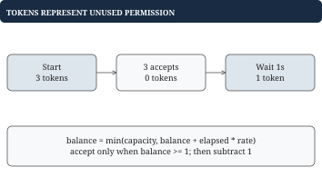

# Chapter 8 - Rate limiting and rolling windows

A rate limiter decides whether a request may proceed. "100 per minute" can mean a fixed calendar bucket, an exact rolling minute, or a burst allowance replenished over time. These policies accept different sequences, so define the guarantee before choosing storage.

## Exact rolling limit: what counts and what expires?

**Problem.** Allow at most L=3 accepted requests in the interval `(now-10, now]`. Rejected attempts do not count, and equal timestamps are allowed. Time is monotone admission time, not arbitrary client event time. Each user has independent state.

At now=10, a request accepted at 0 is outside the interval; one at 4 still counts. The left endpoint is open, the right endpoint closed. This convention settles the exact expiry comparison before implementation.


## Worked example: prune, check, then append

| now | Active timestamps before decision | Decision | Active timestamps after |
| --- | --- | --- | --- |
| 0 | `[]` | Accept | `[0]` |
| 4 | `[0]` | Accept | `[0, 4]` |
| 9 | `[0, 4]` | Accept | `[0, 4, 9]` |
| 10 | `[4, 9]` after pruning 0 | Accept | `[4, 9, 10]` |
| 10 | `[4, 9, 10]` | Reject | `[4, 9, 10]` |

A chronological queue works because expired timestamps form a prefix. Remove that prefix, count survivors, then append only on acceptance. A rejected request must not extend lockout by entering the accepted log.

## Go example: an exact log for one user

A head index avoids repeatedly shifting the entire queue. Periodic compaction copies surviving timestamps once enough consumed storage has accumulated.

```go
type WindowLimiter struct {
	Window   int64
	Limit    int
	accepted []int64
	head     int
}

func (l *WindowLimiter) Allow(now int64) bool {
	if l.Window <= 0 || l.Limit <= 0 {
		return false
	}
	cutoff := now - l.Window
	// The left window boundary is excluded.
	for l.head < len(l.accepted) &&
		l.accepted[l.head] <= cutoff {
		l.head++
	}
	if l.head > 0 && l.head*2 >= len(l.accepted) {
		// Reclaim consumed storage without copying each time.
		l.accepted = append([]int64(nil),
			l.accepted[l.head:]...)
		l.head = 0
	}
	if len(l.accepted)-l.head >= l.Limit {
		return false
	}
	// Rejected attempts never enter the accepted log.
	l.accepted = append(l.accepted, now)
	return true
}
```

Initialize `WindowLimiter{Window: 10, Limit: 3}`. Arithmetic must fit int64. Active storage is `accepted[head:]`; the consumed prefix does not count. Each accepted timestamp is added once and discarded once. Compaction is amortized over consumed entries, so work is amortized O(1) per request; one call can still remove/copy O(L) entries. Retained storage is O(L).

Out-of-order times such as `[9, 1]` break the prefix argument: at now=10 and width=5, fresh 9 can hide expired 1. Use server admission time for this limiter. Late event-time analytics is a different problem.

## Putting the program together: per-user state and atomic admission

Store a limiter per user. Protect creation, pruning, checking, and recording as one operation; two requests must not both claim the final slot. The first correct concurrent design uses one mutex.

```go
type UserLimiter struct {
	mu     sync.Mutex
	users  map[string]*WindowLimiter
	Window int64
	Limit  int
}

func (u *UserLimiter) Allow(user string, now int64) bool {
	// Creation and admission share one atomic decision.
	u.mu.Lock()
	defer u.mu.Unlock()
	if u.users == nil {
		u.users = make(map[string]*WindowLimiter)
	}
	limiter := u.users[user]
	if limiter == nil {
		limiter = &WindowLimiter{
			Window: u.Window, Limit: u.Limit,
		}
		u.users[user] = limiter
	}
	return limiter.Allow(now)
}
```

Time remains monotone for each user's serialized call order. With concurrent callers, timestamps sampled before acquiring the lock can arrive out of order; an injected server clock sampled under this lock avoids that problem. Immutable configuration and the lock preserve the admission invariant. U active users require O(U*L) timestamp storage, plus per-user maps and slice overhead. With 20 million full queues and L=100, bare 8-byte timestamps alone require 16 billion bytes. This is an illustrative bound, not a measured workload.

The sample retains users indefinitely. An idle-state policy can remove a user once every counted request has expired, because recreating an empty log preserves future behavior. Shards or per-user locks reduce contention, but creation and deletion of shared state must also be coordinated.

## Fixed windows: compact counters permit boundary bursts

**Problem.** Count requests separately within fixed periods `[0, 10)`, `[10, 20)`, and so on, with L=3. Store only the bucket number and count. This rule intentionally differs from any rolling 10-second guarantee.

```go
type FixedLimiter struct {
	Window      int64
	Limit       int
	bucket      int64
	count       int
	initialized bool
}

func (f *FixedLimiter) Allow(now int64) bool {
	if f.Window <= 0 || f.Limit <= 0 || now < 0 {
		return false
	}
	bucket := now / f.Window
	if !f.initialized || bucket != f.bucket {
		// Each aligned window starts a separate allowance.
		f.bucket, f.count = bucket, 0
		f.initialized = true
	}
	if f.count >= f.Limit {
		return false
	}
	f.count++
	return true
}
```

This version assumes nonnegative monotone timestamps. Three requests at 9 and three at 10 are all accepted: 6 requests near one boundary, although each fixed bucket contains at most 3. Per request cost and storage are O(1). A two-bucket weighted estimate compresses further than an exact log, but cannot know precisely where requests occurred within a bucket.

## Token bucket: burst capacity plus sustained refill

**Problem.** Permit an initial burst of C=3 requests, then replenish at r=1 token per second. Start full. Each accepted request costs one token. Waiting restores permission, capped at 3; it does not preserve exact request timestamps.



## Worked example: refill even when rejecting

| now | Requests at that time | Balance after | Accepted |
| --- | --- | --- | --- |
| 0 | 4 | 0 | First 3 |
| 0.5 | 1 | 0.5 | None |
| 1 | 1 | 0 | 1 |
| 5 | 4 | 0 | First 3 |

At time 1, refill only the 0.5 seconds since the last balance update. Reusing the whole interval since 0 would double-count refill after the rejected request at 0.5.

```go
type TokenBucket struct {
	Capacity, Rate float64
	tokens, last   float64
}

func NewTokenBucket(capacity, rate,
	now float64) *TokenBucket {
	return &TokenBucket{
		Capacity: capacity, Rate: rate,
		tokens: capacity, last: now,
	}
}

func (b *TokenBucket) Allow(now float64) bool {
	if now < b.last {
		now = b.last
	}
	b.tokens += (now - b.last) * b.Rate
	if b.tokens > b.Capacity {
		b.tokens = b.Capacity
	}
	// Advance on rejection too; never count refill twice.
	b.last = now
	if b.tokens < 1 {
		return false
	}
	b.tokens--
	return true
}
```

Assume finite capacity>=1 and rate>=0. This single-threaded core clamps a backward clock defensively. Floating-point rounding can affect near-boundary decisions; exact fixed units with a retained remainder are an alternative. O(1) state and time are sufficient because the contract is a balance, not an exact recent-event count.

| Policy | State | Guarantee |
| --- | --- | --- |
| Exact rolling log | Accepted timestamps | At most L in every width-W window |
| Fixed counter | Bucket and count | At most L in each aligned bucket |
| Token bucket | Balance and last refill | Burst up to C, then refill rate r |

With C=3 and r=1/s, a bucket can admit 3 immediately and more as time passes; it does not mean "at most 3 in every rolling 10 seconds." Over elapsed interval T, available permission is bounded by starting balance plus r*T, with capacity limiting stored permission.

For several servers, independent per-server state can multiply a user's allowance. A shared atomic decision, stable user ownership, or explicitly partitioned quotas changes that. Define behavior when shared state is unavailable. A distributed limit is an additional contract, not something a local mutex establishes.
