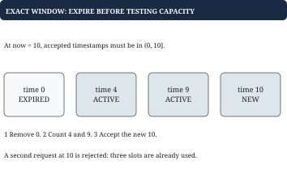

# Chapter 8 — Rate limiting and rolling windows

The policy determines the data structure. “One hundred per minute” is not precise enough to choose an algorithm.

## Define what counts

Our exact limiter allows at most L accepted requests per user in the rolling interval strictly after now minus W and at or before now. Rejected attempts do not count. Requests can share a timestamp. Time is monotone for the limiter and uses integer ticks. Users are independent. At the exact left boundary, an old request no longer counts.

For limit two and window ten, requests at time zero and time one are accepted; time nine is rejected. At time ten, the request at zero leaves the window, so the new request is accepted. The retained accepted timestamps are one and ten. Writing this trace before code settles the off-by-one choice.

## Exact sliding log

Store a map from user ID to a queue of accepted timestamps. Before deciding, discard timestamps at or before now minus W. If the remaining length is already L, reject. Otherwise append now and accept. Chronological order makes expired records a prefix, so no search is needed. A slice with a head index avoids shifting every remaining timestamp on every removal.

Each accepted timestamp is appended once and removed once, so work is amortized constant per request. A single request after a long idle period may remove L entries and cost O(L). Memory is O(U times L) for U active users, plus bookkeeping for idle users if you never delete them. Rejected attempts must not be appended under this contract, or an attacker could keep extending lockout by sending more requests.

With twenty million users and limit one hundred, even bare eight-byte timestamps could occupy sixteen billion bytes if every queue were full, before map and slice overhead. This is an illustrative worst-case calculation, not a measured Netflix workload. Aggregate timestamps within buckets when approximate precision is acceptable; retain exact timestamps when boundary accuracy is required. Delete empty idle users or expire their state, while ensuring cleanup itself does not create unbounded latency.

**Failure case.** Out-of-order timestamps can hide an expired item behind a fresh queue head.

An expired timestamp might appear behind a fresh one, so removing only a prefix fails. Use monotone server admission time for a request limiter. Event-time analytics with late arrivals is a different problem and may require ordered storage, lateness bounds, or explicit rejection of old data.

## Fixed windows are cheaper but allow boundary bursts

A fixed-window counter stores a bucket number and count per user, resetting when the bucket changes. With limit one hundred, a user can send one hundred requests just before a minute boundary and another hundred just after it. That is valid per fixed minute but violates a strict rolling-minute maximum. Say which guarantee the implementation provides.

A two-bucket sliding estimate weights the previous bucket's count by the fraction still overlapping the current window. It is compact but assumes something about the distribution of requests within a bucket. It cannot be exact without more information. At interview scale, describing the approximation and a burst counterexample is more valuable than asserting it is “basically the same.”

## Token buckets express burst capacity and sustained rate

A token bucket has capacity C, refill rate r tokens per tick, current tokens, and last refill time. On each request, add elapsed time times r, capped at C, then move last refill time to now. If at least one token exists, subtract one and accept. A bucket starts full in our contract, allowing an initial burst.

With capacity three and refill one token per second, three requests at time zero pass and a fourth fails. At time one, one token has refilled, so one request passes. Long inactivity never accumulates more than three tokens. Fractional tokens allow smooth refill; integer arithmetic with retained remainder is an alternative when exact units are important.

A token bucket with capacity one hundred and refill ten per second is not “at most one hundred per rolling minute.” It intentionally permits a burst plus continued refill. Over an interval of length T, accepted demand is bounded roughly by capacity plus rate times T, subject to initial state and endpoint conventions. Choose it when bursts are acceptable and long-run throughput must be controlled.

Refill must account for rejected requests too: update the timestamp whenever you materialize elapsed refill, or the same elapsed time can be counted again. Our reference clamps a backward clock reading to the previous time. That is defensive behavior, not permission to use arbitrary client timestamps. At very small scales, floating-point arithmetic can affect boundaries; tests use exactly representable examples and document this limitation.

## Concurrency and multiple servers

Two simultaneous requests can both observe one remaining slot and both accept unless prune, check, and append form one atomic operation. A mutex solves this inside a process. Per-user locks or shards can improve concurrency when required, but map creation and lock lifetime must still be coordinated. Token refill, check, and debit likewise need one critical section.

Independent per-server limiters can multiply a user's global allowance. A shared atomic decision, stable ownership of each user's state, or intentionally partitioned quotas can address that, with different availability and utilization trade-offs. A distributed system discussion should name failure policy: if the limiter's state service is unavailable, does the request pass or fail? No single answer is correct for every service.

## Start from the guarantee a caller should observe

“One hundred requests per minute” can describe several different products. A billing counter might group requests by calendar minute. An abuse rule might forbid any rolling sixty-second interval from containing more than one hundred accepted requests. A service protection rule might permit a burst after inactivity while enforcing a sustained rate. Those are not small implementation variations; they permit different request sequences. A correct implementation begins with the observable guarantee.

An exact sliding log retains the recent accepted requests because each timestamp can affect a future boundary decision. A fixed-window counter forgets where within the bucket those requests occurred. That lost detail is why it cannot distinguish one hundred requests spread throughout a minute from one hundred clustered at the end. Compression of state usually comes with a question: are the histories being merged truly equivalent for the required queries?

A token bucket summarizes a different history. Its token balance says how much accumulated permission remains. Waiting restores permission at a configured rate, but the cap prevents indefinite accumulation. You can think of the balance as unused capacity, rather than as a count of events inside a precise interval. That interpretation explains why a bucket naturally allows bursts and why it does not enforce an exact rolling-window count with the same parameters.

Atomicity matters at the decision point. Imagine the exact limiter has one slot remaining. Two callers independently read that fact, then both append an accepted request. Every individual access could use a thread-safe map and still produce an invalid combined result. The protected operation must include removal of obsolete events, the limit check, and recording acceptance. For a bucket it must include refill, checking balance, and debiting a token. The state invariant is what defines the lock boundary.

Large user populations add lifecycle questions. A user who disappears does not trigger their own cleanup. If state remains forever, the number of remembered users can grow even while each queue is bounded. Deleting idle state is safe only when reconstructing it gives the same future behavior. An empty exact sliding log can disappear after all counted requests leave the horizon. A token bucket can disappear once it would be fully replenished, assuming a recreated bucket starts full.

## Worked example: the exact left boundary matters

Allow at most three accepted requests in any trailing ten seconds. At time t, count accepted timestamps strictly greater than t minus ten and at most t. Requests arrive at 0, 4, 9, 10, and 10. Rejected attempts do not enter the queue under this contract.



| Request time | Expired first | Decision | Queue afterward |
| --- | --- | --- | --- |
| 0 | None | Accept | 0 |
| 4 | None | Accept | 0, 4 |
| 9 | None | Accept | 0, 4, 9 |
| 10 | 0 | Accept | 4, 9, 10 |
| 10 again | None | Reject | 4, 9, 10 |

The entry at zero leaves exactly at time ten. Removing timestamps strictly less than the boundary instead of less than or equal to it would incorrectly deny the first request at ten. The method order is therefore observable: read the trusted clock, remove expired entries, compare live count with the limit, then append only if accepted.

The queue argument requires nondecreasing timestamps. If an old timestamp arrives behind a fresh one, stopping cleanup at the first fresh record can leave expired records hidden later. Server admission time restores the ordered assumption; supporting arbitrary event time requires a different data model.

## Worked example: two policies allow different bursts

A fixed-window limit of three per ten-second bucket can accept three requests at 9.9 seconds and three more at 10.1. Each calendar bucket obeys its limit, yet six requests arrive within 0.2 seconds. This is not a coding defect in the counter. It is a weaker guarantee than the exact trailing window.

A token bucket with capacity three and refill rate one token per second expresses another guarantee. It begins full. Three immediate requests consume all tokens. Half a second later, it has half a token, so a unit-cost request is rejected. Another half second later it reaches one token and can admit one request.

Refill must preserve fractional progress if the representation supports fractional time. Discarding the half token on every rejection can prevent recovery under frequent retries. One correct approach computes the new balance from elapsed time, caps it at capacity, and updates both balance and last-refill time even if the request is rejected. An integer-only representation needs an explicit policy for carrying unused fractional time.

The choice follows the requirement: exact recent count needs the timestamp queue; inexpensive calendar-bucket accounting can use a fixed counter; a sustained rate with controlled bursts suits a token bucket. Their similar names do not make their accepted request sequences equivalent.

## Putting the program together: exact admission and a token bucket

For the exact limiter, the public operation Allow(user, now) returns a boolean. State consists of the limit, window length, and per-user timestamp queues. Each queue has a timestamp slice and a head index. The contract requires nondecreasing admission time and counts only accepted requests in the interval after now minus window through now.

Allow finds or creates the user's queue. Advance its head while the oldest retained timestamp is at or before the cutoff. Count the entries from head to the end. If already at the limit, return false without appending. Otherwise append now and return true. Periodically compact the slice when discarded slots become a significant fraction of its contents. The pruning, count check, and append belong to one critical section if callers overlap.

With limit two and window ten, Allow at zero and one returns true; at nine false; at ten true. After that last call the active queue contains one and ten. A rejected call must not alter that accepted-event sequence. Another user has independent state. Idle user cleanup is a separate bounded-memory concern; no new request arrives to trigger self-cleanup for a disappeared user.

For a token bucket, the fields are capacity, refill rate, current tokens, and last-accounted time. Allow first brings tokens up to now: add elapsed time times rate, capped at capacity, and update the accounted time. If tokens are below one, return false. Otherwise subtract one and return true. Protect that full sequence atomically. Define the clock policy and whether fractional tokens are represented by floating point or exact integer units.

A capacity-three bucket starts with three immediate acceptances and then rejects. After one second at one token per second it accepts one more. Long idle time returns it only to capacity. These tests validate a different guarantee from the exact rolling log. The two structs share an admission API but should not be presented as interchangeable implementations of the same rule.

## Go example: expire, count, then admit

This complete single-user limiter uses nondecreasing integer-second timestamps, a positive window, and a nonnegative limit. Timestamps and subtraction must fit int64. Construction supplies those fields; callers are serialized. The method counts accepted requests only.

```go
type WindowLimiter struct {
    Window int64
    Limit int
    accepted []int64
}

func (l *WindowLimiter) Allow(now int64) bool {
    cutoff := now - l.Window
    expired := 0
    for expired < len(l.accepted) &&
        l.accepted[expired] <= cutoff {
        expired++
    }
    l.accepted = l.accepted[expired:]
    if len(l.accepted) >= l.Limit {
        return false
    }
    l.accepted = append(l.accepted, now)
    return true
}
```

For Window ten and Limit three, requests 0, 4, 9, 10, 10 produce true, true, true, true, false. At time ten, timestamp zero is removed before capacity is checked. A rejected request is not appended, so retries do not silently change the policy. Limit zero denies every request.

Each accepted timestamp is appended once and discarded once, yielding amortized constant queue work per request. A single request may expire many timestamps. Reslicing retains the backing array; bounded queue length does not mean immediate release of its old allocation. A ring buffer or periodic compaction gives more explicit reuse. Supporting many users adds a map of limiter states and a separate idle-user cleanup policy; it does not change this per-user admission rule.
