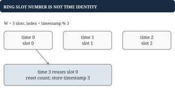
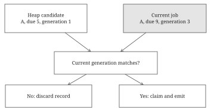

# Chapter 9 - Deduplication, counters, versions, and scheduling

Event services combine identity with time. This chapter suppresses repeated deliveries, counts recent hits, queries historical values, and releases scheduled work. The same data structures recur, but each operation has a distinct promise about what must happen once, expire, or remain queryable.

## Deduplication: an ID identifies one logical event

**Problem.** Deliveries `[(e1, A), (e2, B), (e1, A)]` should produce new-event results `[true, true, false]`. Different IDs with identical payloads remain different events. Repeated IDs are assumed to carry identical payloads.

A set works for lifetime-long suppression. For a 10-minute horizon, store each ID's expiry from its first accepted processing time. A duplicate does not refresh that deadline in this contract. An ID arriving after expiry can be accepted again.

| Processing time | Delivery | Stored deadline | New? |
| --- | --- | --- | --- |
| 0 | e1 | 600 | Yes |
| 599 | e1 | 600, unchanged | No |
| 600 | e1 | 1200 | Yes |

## Go example: check and record as one decision

```go
type Deduper struct {
    mu sync.Mutex
    expiry map[string]int64
    Horizon int64
}

func (d *Deduper) Accept(id string, now int64) bool {
    d.mu.Lock()
    defer d.mu.Unlock()
    if d.Horizon <= 0 {
        return true
    }
    if deadline, found := d.expiry[id]; found &&
        now < deadline {
        return false
    }
    if d.expiry == nil {
        d.expiry = make(map[string]int64)
    }
    d.expiry[id] = now+d.Horizon
    return true
}
```

Assume monotone processing time and fitting deadline arithmetic. Accept is expected O(1). Expired IDs remain until reused in this simple implementation; scan or deadline-heap cleanup is required for bounded retention. Multiple servers need shared identity coordination, not independent local sets.

This is duplicate suppression, not durable exactly-once effects. Mark before a callback and a crash can suppress unfinished work. Mark after a callback and a crash can permit the effect twice. An idempotent destination or a transaction connecting effect and marker must address that gap.

## Hit counters: aggregate equal-time arrivals

**Problem.** Record hits at `times = [100, 101, 101, 150]`. At now=150, the rolling interval `(90, 150]` contains 4 hits. At now=160, `(100, 160]` contains 3. The query's now value is part of the input.

With integer-second timestamps, repeated hits in one second share a bucket. A running total avoids recounting every retained event. An expiry queue preserves the contribution to subtract.

| Bucket | Count at now=150 | Included at now=160? |
| --- | --- | --- |
| 100 | 1 | No; exact left boundary |
| 101 | 2 | Yes |
| 150 | 1 | Yes |

```go
type HitBucket struct {
    At int64
    Count int
}

type HitCounter struct {
    Window int64
    buckets []HitBucket
    total int
}

func (c *HitCounter) prune(now int64) {
    expired := 0
    for expired < len(c.buckets) &&
        c.buckets[expired].At <= now-c.Window {
        c.total -= c.buckets[expired].Count
        expired++
    }
    c.buckets = c.buckets[expired:]
}

func (c *HitCounter) Record(now int64) {
    c.prune(now)
    last := len(c.buckets)-1
    if last >= 0 && c.buckets[last].At == now {
        c.buckets[last].Count++
    } else {
        c.buckets = append(c.buckets, HitBucket{now, 1})
    }
    c.total++
}

func (c *HitCounter) Count(now int64) int {
    c.prune(now)
    return c.total
}
```

Assume Window>0, nondecreasing times across Record and Count, and integer counts that fit. Each bucket enters/leaves once, giving amortized O(1) work plus allocation costs. The slice version can retain backing storage and needs compaction in a long-lived service. For integer-second fixed width W, at most W active buckets exist.

## Worked example: a ring slot needs an absolute timestamp

A ring of W=3 slots can use `slot = time % 3`. Time 0 and time 3 both use slot 0. Their equal slot number does not make them the same bucket. Store `(absolute time, count)` in every slot and reset count when the timestamp changes.



For arbitrary subsecond queries, whole-second buckets lose precision at a partial boundary. For variable query horizons, one fixed running total is insufficient; retain enough history for the largest supported horizon and use scans or prefix summaries. Out-of-order event times also invalidate FIFO pruning unless handled explicitly.

## Time-based values: retain history for predecessor queries

**Problem.** After `quality = [(10, "HD"), (20, "UHD")]`, a query at 15 returns HD, at 25 returns UHD, and at 9 returns missing. A map of only the latest value cannot answer the historical query.

Chapter 3's TimeStore keeps an ordered Version slice per key. Get finds the first timestamp greater than the query and returns its predecessor. Equal-time writes replace the latest version; earlier writes are rejected under that append-only contract.

A deletion at time 30 requires an explicit tombstone version if old queries must remain possible. Physically erasing all history would make a time-15 query incorrect. Retention is a separate rule: expiring history may intentionally make old answers unavailable.

## Scheduling: earliest due record plus current task identity

**Problem.** Schedule A for time 5, cancel it, then schedule a new A for time 9. At time 5 the old record must not run the new task. At time 9 the new generation can be claimed once.

A deadline min heap answers which record is due next. A current-generation map answers whether that record is still authorized. Cancellation deletes the map entry; rescheduling assigns a fresh global generation. Heap records can remain as stale work.



## Worked example: claim before returning the task

| Action | Current map | Heap records |
| --- | --- | --- |
| Schedule A at 5 | `{A: 1}` | `[(5, A, 1)]` |
| Cancel A | `{}` | Old record remains |
| Schedule A at 9 | `{A: 3}` | Old plus `(9, A, 3)` |
| RunReady at 5 | `{A: 3}` | Discard generation 1 |
| RunReady at 9 | `{}` | Claim generation 3 |

The skipped generation 2 is harmless; only uniqueness matters. Claiming removes current identity before exposing the job, preventing another worker from claiming it again in this in-memory lifecycle.

## Go example: validate due time and generation

```go
type JobRecord struct {
    ID string
    Due int64
    Generation uint64
}

func ClaimJob(current map[string]uint64,
    record JobRecord, now int64) bool {
    if record.Due > now {
        return false
    }
    generation, found := current[record.ID]
    if !found || generation != record.Generation {
        return false
    }
    delete(current, record.ID)
    return true
}
```

This helper is the authorization step, not a full scheduler. The surrounding scheduler must hold its lock across heap removal and ClaimJob, allocate unique generations, and execute callbacks after releasing the lock. A repeated claim fails because the current entry was removed.

## Putting the program together: a cancellable scheduler

Schedule assigns a generation, records it in current, and pushes `(due, ID, generation)` into a min heap. Cancel deletes current[ID]. RunReady repeatedly removes due records and returns only successful claims. A future root stops the loop. The heap interface has the same shape as ExpiryHeap, with Due as the comparison field.

Here is the complete due-draining step using the same expiry-record representation as chapter 7. The current map still describes tasks, not cache entries.

```go
func ReadyJobs(due *ExpiryHeap,
    current map[string]uint64, now int64) []string {
    var ready []string
    for due.Len() > 0 && (*due)[0].Deadline <= now {
        record := heap.Pop(due).(Expiry)
        job := JobRecord{
            ID: record.Key, Due: record.Deadline,
            Generation: record.Generation,
        }
        if ClaimJob(current, job, now) {
            ready = append(ready, job.ID)
        }
    }
    return ready
}
```

Removing r records costs O(r log(h+1)); some records may be stale, so count them too. Cancellation is expected O(1) with lazy invalidation, but stale heap memory can grow. Equal-deadline order is unspecified here; add an ID or sequence tie rule if required.

A claimed task is not necessarily a completed task. A worker crash after claim loses it in this simple design. Durable retries need lifecycle states, leases or acknowledgements, and idempotent effects. Those guarantees cannot be obtained by renaming a local heap "exactly once."
