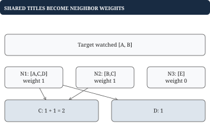

# Chapter 10 - Recommendations and streaming ranking

A recommendation exercise can be a precise coding problem without implementing machine learning. This chapter ranks supplied candidates, applies simple diversity rules, derives a toy collaborative score, and maintains rolling watch statistics. Each has a different input contract and state requirement.

## Separate eligibility, identity, score, and order

**Problem.** Candidates have ID, score, genre, and eligibility. Exclude watched or ineligible records, then retain the highest eligible score per ID. Equal scores for the same ID choose the smaller genre. Return at most k titles by descending score, breaking ties by ascending ID. Nonpositive k returns an empty result.

For `[(A,8), (B,9), (A,10), (C,9)]`, with B watched and k=2, output is `[(A,10), (C,9)]`. Ranking duplicates first could spend both result slots on A; filtering only after selection could return too few titles.


| Stage | State for this input |
| --- | --- |
| Input | `[(A,8), (B,9), (A,10), (C,9)]` |
| Exclude watched B | `[(A,8), (A,10), (C,9)]` |
| Resolve duplicate A | `[(A,10), (C,9)]` |
| Rank and limit | `[(A,10), (C,9)]` |

These are original toy rules, not a claim about Netflix's actual recommendation formula. If eligibility belongs to a canonical catalog record rather than individual candidates, resolve that identity first; that changes the contract.

## Go example: encode the complete ranking comparator

The function below ranks already distinct eligible candidates. It copies before sorting, preserving caller input.

```go
type Candidate struct {
	ID    string
	Score int64
}

func TopTitles(candidates []Candidate, k int) []Candidate {
	if k <= 0 {
		return nil
	}
	ranked := append([]Candidate(nil), candidates...)
	sort.Slice(ranked, func(i, j int) bool {
		a, b := ranked[i], ranked[j]
		if a.Score != b.Score {
			return a.Score > b.Score
		}
		// Resolve ties before truncating to k winners.
		return a.ID < b.ID
	})
	if k < len(ranked) {
		ranked = ranked[:k]
	}
	return ranked
}
```

For `[(D,7), (A,9), (C,7)]`, k=2, output is `[(A,9), (C,7)]`. The equal-score tie is decided before truncating, not afterward. k larger than input returns all; k<=0 returns empty. Sorting u candidates costs O(u log u), space O(u) for the copy.

## Putting the program together: filter and deduplicate before ranking

```go
type CatalogCandidate struct {
	ID, Genre string
	Score     int64
	Eligible  bool
}

func RankEligible(input []CatalogCandidate,
	watched map[string]bool, k int) []Candidate {
	if k <= 0 {
		return nil
	}
	unique := make(map[string]CatalogCandidate)
	for _, item := range input {
		// Filter before an ID can occupy a result slot.
		if !item.Eligible || watched[item.ID] {
			continue
		}
		old, found := unique[item.ID]
		if !found || item.Score > old.Score ||
			(item.Score == old.Score &&
				item.Genre < old.Genre) {
			unique[item.ID] = item
		}
	}
	candidates := make([]Candidate, 0, len(unique))
	for _, item := range unique {
		candidates = append(candidates,
			Candidate{ID: item.ID, Score: item.Score})
	}
	return TopTitles(candidates, k)
}
```

For n input records and u distinct survivors, expected time is O(n+u log u), space O(u). A size-k heap can reduce selection to O(u log(k+1)), but the deduplication map still uses O(u) memory. If smaller IDs win ties, the heap root must consider the larger tied ID the worse winner.

## Worked example: diversity needs candidates below the original cutoff

**Problem.** Choose k=2 distinct titles with at most one from each genre. Fill as many slots as possible up to k, then maximize total score for that count. Candidates are `[(A,action,10), (B,action,9), (C,drama,8)]`. Ordinary top 2 gives A and B, violating the rule. The constrained answer is A and C.

| Candidate in score order | Chosen so far | Decision |
| --- | --- | --- |
| A, action, 10 | `[A]` | First action title |
| B, action, 9 | `[A]` | Skip used genre |
| C, drama, 8 | `[A, C]` | Fill second genre |

With exactly one disjoint genre per title, sorting all distinct eligible candidates and accepting while genre quota permits maximizes score for the required count. This core assumes identity/eligibility have already been resolved. Negative scores still fill available slots under this contract; if selecting fewer titles is allowed solely to maximize total score, skip negative scores instead.

```go
func GenreWinners(input []CatalogCandidate,
	k int) []CatalogCandidate {
	if k <= 0 {
		return nil
	}
	ranked := append([]CatalogCandidate(nil), input...)
	sort.Slice(ranked, func(i, j int) bool {
		if ranked[i].Score != ranked[j].Score {
			return ranked[i].Score > ranked[j].Score
		}
		return ranked[i].ID < ranked[j].ID
	})
	used := make(map[string]bool)
	var out []CatalogCandidate
	for _, item := range ranked {
		if used[item.Genre] {
			continue
		}
		used[item.Genre] = true
		out = append(out, item)
		if len(out) == k {
			break
		}
	}
	return out
}
```

Discarding everything below ordinary top k would lose C before the constraint is applied. Multiple overlapping tags and simultaneous quotas need a new optimality argument; this simple greedy proof does not cover them. Interleaving source lists for fairness similarly differs from global score order. A heap over sorted source heads gives a k-way score merge; alternation gives a different policy.

## Collaborative scoring: shared history becomes a weight

**Problem.** Target watched `[A, B]`. Neighbor histories are `N1=[A, C, D]`, `N2=[B, C]`, `N3=[E]`. Define similarity as the number of distinct shared titles. Add each neighbor's similarity to their unwatched titles.



| Neighbor | Shared titles | Weight | Contributions |
| --- | --- | --- | --- |
| N1 | `[A]` | 1 | C:+1, D:+1 |
| N2 | `[B]` | 1 | C:+1 |
| N3 | `[]` | 0 | None |

Scores are `{C: 2, D: 1}`. Repeated views are deduplicated within each history so the formula counts distinct overlaps.

```go
func CollaborativeScores(target []string,
	neighbors [][]string) map[string]int64 {
	watched := make(map[string]bool)
	for _, id := range target {
		watched[id] = true
	}
	scores := make(map[string]int64)
	for _, history := range neighbors {
		distinct := make(map[string]bool)
		var weight int64
		for _, id := range history {
			// Repeated views count once toward similarity.
			if !distinct[id] && watched[id] {
				weight++
			}
			distinct[id] = true
		}
		if weight == 0 {
			continue
		}
		for id := range distinct {
			if !watched[id] {
				scores[id] += weight
			}
		}
	}
	return scores
}
```

Time is expected linear in supplied history size plus distinct-history scans. Storage includes watched, scores, and one neighbor's distinct set. An inverted index from title to users can narrow potential neighbors, while very popular titles still generate many matches. No overlap is a cold-start case; a fallback popularity list is another explicitly supplied rule.

## Streaming averages: expiration must reverse contributions

**Problem.** Maintain per-title averages over `(now-W, now]`. Events carry title, event time, and positive duration. Input is monotone in event time. Store a sum and count per title and retain events so each expired contribution can be subtracted.

For A's durations `[10, 2]`, average is 6. When 10 expires, subtract it and decrement count: sum=2, count=1, average=2. A running mean alone does not preserve which old contribution to remove.

```go
type StatEvent struct {
	At      int64
	Title   string
	Minutes int64
}

type VideoTotal struct {
	Sum   int64
	Count int
}

type RollingStats struct {
	Window int64
	events []StatEvent
	totals map[string]VideoTotal
}

func (s *RollingStats) Expire(now int64) {
	expired := 0
	for expired < len(s.events) &&
		s.events[expired].At <= now-s.Window {
		e := s.events[expired]
		// Undo both parts of the average, not just the sum.
		total := s.totals[e.Title]
		total.Sum -= e.Minutes
		total.Count--
		if total.Count == 0 {
			delete(s.totals, e.Title)
		} else {
			s.totals[e.Title] = total
		}
		s.events[expired] = StatEvent{}
		expired++
	}
	s.events = s.events[expired:]
}
```

Clearing consumed records releases title references. A long-lived queue also needs compaction or a ring strategy to bound retained backing allocations. This core assumes Window>0 and fitting sums/counts.

```go
func (s *RollingStats) Record(e StatEvent) bool {
	if e.Minutes <= 0 {
		return false
	}
	s.Expire(e.At)
	if s.totals == nil {
		s.totals = make(map[string]VideoTotal)
	}
	total := s.totals[e.Title]
	total.Sum += e.Minutes
	total.Count++
	s.totals[e.Title] = total
	s.events = append(s.events, e)
	return true
}

func (s *RollingStats) Average(title string,
	now int64) (float64, bool) {
	s.Expire(now)
	total, found := s.totals[title]
	if !found {
		return 0, false
	}
	return float64(total.Sum) / float64(total.Count), true
}
```

All Record and query times must be nondecreasing. Otherwise a newly recorded old event can hide behind fresh events, and previously expired contributions cannot be restored. Each accepted event enters/leaves once, giving amortized O(1) updates; retained event memory depends on arrival rate times window width, not just number of titles.

## Worked example: decreasing scores invalidate winner-only storage

Initially A totals 13 and B totals 6, so top 1 is A. An A contribution of 10 expires: scores become `{A: 3, B: 6}`, and top 1 must become B. A heap containing only the old winner A has forgotten its needed replacement.

Retain all live aggregates and sort on query for a clear baseline. An indexed heap or another ordered structure can maintain all changing scores. A static size-k selection proof is correct only while discarded candidates cannot become relevant later. Expiration changes that assumption; approximate heavy-hitter methods change the accuracy contract.
