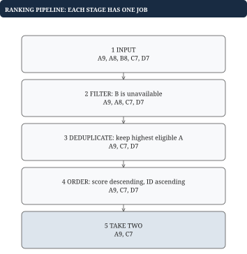

# Chapter 10 — Recommendation and streaming ranking tasks

For a coding interview, turn “recommend movies” into a small, testable pipeline with explicit inputs, filters, scores, and tie rules.

## Understand the domain without overbuilding it

Netflix describes recommendations as using member interactions, similar tastes, and title information, with personalization affecting rows and ordering. This gives useful domain context, but it is not an interview specification. [Netflix's recommendation overview](https://help.netflix.com/en/node/100639).

A general recommendation pipeline first retrieves plausible candidates, scores them, and applies final constraints. Content-based retrieval uses item attributes; collaborative methods learn from patterns across users and items. This is a conceptual foundation, not a requirement to train a model in Go. [Google's candidate generation overview](https://developers.google.com/machine-learning/recommendation/overview/candidate-generation).

For an interview, ask what is already given. If scores are supplied, your task may be filtering and top k selection. If co-watch histories are given, it may be graph or frequency aggregation. If scores update live, it may be an indexed heap or an ordered-state problem. The title “recommendation engine” does not choose the algorithm.

## A precise ranking exercise

Input is a list of candidates with ID, genre, integer score, and eligibility flag, plus a set of watched IDs and k. Exclude ineligible and watched candidates. Deduplicate remaining IDs by retaining their highest score. For equal scores of the same ID, retain the lexicographically smaller genre so metadata is deterministic. Return at most k titles ordered by descending score, then ascending ID. Nonpositive k returns an empty result.

For candidates A score eight, B score nine, A score ten, C score nine, with B watched and k two, the winners are A then C. Deduplication must happen before top k selection, or two copies of A can occupy both slots. Eligibility is applied before deduplication in this contract; if eligibility instead belongs to the canonical catalog record, resolve canonical metadata first. That is a requirements distinction worth raising.

The simple baseline builds a map of unique eligible candidates and sorts its values. For n input records and u unique eligible IDs, expected work is O(n plus u log u), and space is O(u). When k is much smaller than u, use the bounded heap from lesson 3, then sort the k winners. The deduplication map still uses O(u) space even though the heap uses only O(k). Do not claim the whole pipeline uses O(k) memory.

**Failure case.** Selecting top k before applying a genre restriction can discard needed alternatives.

No. The original top k may all belong to one genre, while the best allowed candidates from other genres lie outside it. Apply the constraint during selection over sufficient candidates, or select each genre's best first under the one-per-genre contract.

## Constraints change what top k means

For a single disjoint genre per movie and a cap of one per genre, keeping the best movie of each genre and then selecting the best k genre winners maximizes total score. For a cap greater than one, sorted greedy acceptance respects the per-genre quota. If movies have multiple overlapping tags and several simultaneous quotas, a simple greedy strategy need not be globally optimal. State whether you are maximizing score exactly or applying a reasonable reranking heuristic.

Another common follow-up asks to interleave two ranked lists while removing duplicates. Two pointers with a seen set can preserve a chosen alternation policy. This does not necessarily preserve global score order. Define whether fairness between sources or highest overall scores has priority. If each source is sorted and global score order is required, a heap across source heads gives a k-way merge.

## Small collaborative scoring without machine learning

Suppose a target user watched A and B. Neighbor one watched A, C, D; neighbor two watched B, C; neighbor three watched E. Define similarity as number of shared watched titles. Neighbor one and two each have weight one; neighbor three has zero. Add a neighbor's weight to each of their unwatched titles. C receives two and D one. Recommend C before D. Use sets per history so repeat viewing does not accidentally count as multiple distinct overlaps.

This is an original toy scoring rule. It illustrates joins and aggregation, not Netflix's actual ranking formula. An inverted index from title to users can avoid scanning every user to find overlaps, although extremely popular titles can still generate many candidates. Define cold-start behavior when no overlap exists, such as a supplied popularity list filtered by eligibility.

## Streaming statistics add reversibility

For average watch duration per video, store sum and count, then divide only when count is positive. For a one-hour window, retain events in a time queue and subtract each expired event's duration and count from its video's aggregate. A running mean by itself does not retain enough information to remove arbitrary old contributions easily. If ordering is not monotone, a FIFO expiration queue is no longer sufficient.

Dynamic top k is harder than one-time top k. Counts can fall when events expire. A size-k heap of only current winners may have forgotten the best replacement outsider. Keep full aggregates and rebuild on query, or maintain an indexed structure over all candidates; discuss the update-versus-query trade-off. An approximate heavy-hitter sketch is a different contract with error and ranking uncertainty.

## Make the recommendation problem small enough to reason about

A recommendation prompt can sound enormous because the real product contains retrieval models, ranking models, experiments, data pipelines, and policy rules. A coding exercise usually exposes only a small piece of that system. Your first task is to identify the piece. Are candidate scores already supplied? Are you deriving a toy score from viewing histories? Are you maintaining changing scores over time? These versions require different programs even though they all return movie IDs.

Separate the stages in words. Eligibility decides whether a candidate is allowed at all. Identity resolution ensures one logical title is not counted twice. Scoring assigns a comparable value under an agreed formula. Selection chooses a limited set. Ordering determines the sequence in which the chosen set is returned. These stages can interact: discarding duplicates after selecting winners may leave too few distinct results, and filtering only after selection can hide valid candidates just below the original cutoff.

Think of a supplied score as an input contract, not an explanation of user enjoyment. Your coding task might require ranking by that number without evaluating whether the number is a good model. A toy collaborative rule can be educational, but it should be described honestly as a rule we define for the exercise. It is not evidence of Netflix's actual model architecture or training objective.

Determinism is part of the API. Two candidates with equal scores need an agreed order if callers or tests compare results. A map's iteration order should not accidentally decide which result wins. Ties become particularly subtle at a heap boundary because the heap keeps the worst retained winner at its root. You must reverse both the score direction and the tie direction consistently.

Temporal ranking reveals why a static top-k proof has limits. While processing a fixed set, once k better candidates dominate an outsider, discarding the outsider is safe. Later expiration can reduce the winners' scores. The outsider may then deserve promotion, but a winner-only structure has forgotten it. An algorithm can be correct for static selection and insufficient for dynamic maintenance without any contradiction: the future operations changed what information must be retained.

## Worked example: rank only after eligibility and identity are settled

Return the two highest-scoring eligible titles, breaking ties by smaller title ID. Records are A with score nine, another A with score eight, B with score eight but unavailable, C with score seven, and D with score seven. Define duplicate resolution as keeping the highest eligible score for each title.



| Stage | Remaining candidates | Reason |
| --- | --- | --- |
| Raw records | A9, A8, B8, C7, D7 | Five records, four identities |
| Eligibility | A9, A8, C7, D7 | B unavailable |
| Deduplication | A9, C7, D7 | Highest eligible A score wins |
| Ranking | A9, C7, D7 | C precedes D on tied score |
| Top two | A9, C7 | Two distinct eligible titles |

Selecting the best two raw records would produce two copies of A. Deduplicating that result afterward would leave only one recommendation, even though valid alternatives existed. Similarly, taking top k before filtering can spend slots on unavailable titles. The pipeline order follows from what a result slot represents.

For a small candidate set, sorting the distinct eligible records is a clear baseline. A size-k heap saves work when the candidate set is large and k is small. Keep the worst retained candidate at the root so replacement compares against the current admission threshold. Apply the same score-and-ID rule at every stage; a final sort cannot recover a candidate that an inconsistent heap already discarded.

## Worked example: diversity changes which candidates are useful

Suppose scores and genres are A9 drama, B8 drama, C7 comedy, and D6 documentary. Return three titles with at most one per genre. Unconstrained top three is A, B, C. Removing repeated genres afterward leaves only A and C and loses the opportunity to select D.

For this simple constraint, with each title assigned exactly one genre and an independent scalar score, first keep the best eligible title per genre. The representatives are A9, C7, and D6. Rank those representatives to obtain three results. Replacing any lower-scoring choice from a genre with its best representative cannot violate the one-per-genre constraint, which justifies this reduction.

That argument has limits. A title belonging to multiple constrained categories can compete for several budgets at once. Rules such as requiring two languages while limiting repeated actors interact across choices. Greedily taking the highest individual score can then block a better feasible combination. State the simpler contract rather than treating every recommendation task as the same heap exercise.

The domain story suggests possible requirements, but the coding task remains a sequence of precise operations: eligibility, canonical identity, aggregation if needed, comparison, and constrained selection. Keeping them separate makes a changed rule local and makes its correctness easier to explain.

## Putting the program together: ranking eligible distinct titles

The function accepts candidate records, a watched-ID set, and k. Each candidate has ID, genre, integer score, and eligibility. It returns up to k distinct eligible unwatched titles, highest score first and smallest ID first on ties. For duplicate IDs, retain the highest-scoring eligible record; equal-score duplicates use the smaller genre string for determinism. Nonpositive k returns an empty result.

First scan candidates. Skip ineligible or watched records. Look up each remaining ID in a deduplication map. Keep the incoming record only if no record exists or it wins the duplicate-resolution rule. This stage establishes one canonical candidate per eligible ID under the exercise's policy. It must happen before selecting final winners.

For the baseline, collect the map values and sort using the final comparison. Return at most the first k. For a small k among many unique candidates, instead maintain a heap whose root is the worst retained winner. Push until it has k entries. Thereafter replace its root only when a newcomer is better, then repair the heap. Sort the retained winners into final output order before returning.

On A score eight, B nine, A ten, C nine, with B watched and k two, the canonical map contains A ten and C nine, so return A then C. If A and C tie, A still comes first. Test duplicate IDs, no eligible records, k larger than the result, and all equal scores. The comparison rule should give the same result regardless of map iteration order.

Expected scan cost is linear. Sorting all unique candidates costs u log u; a bounded heap costs u log k plus sorting the final k. Both versions still retain the deduplication map, so their total auxiliary memory is not merely k. A one-per-genre rule changes selection: keep each genre's best representative before global selection, provided each title belongs to exactly one genre and the objective is the sum of these supplied scores.

## Go example: write the ranking contract into the comparator

This complete function accepts candidates that are already eligible and unique by ID. It implements the sorting baseline, preserving the caller's slice. Include `import "sort"` with the file's imports. The copy is shallow, which is sufficient because these fields are a string and an integer.

```go
type Candidate struct {
    ID string
    Score int64
}

func TopTitles(candidates []Candidate, k int) []Candidate {
    if k <= 0 {
        return nil
    }
    ranked := append([]Candidate(nil), candidates...)
    sort.Slice(ranked, func(i, j int) bool {
        a, b := ranked[i], ranked[j]
        if a.Score != b.Score {
            return a.Score > b.Score
        }
        return a.ID < b.ID
    })
    if k < len(ranked) {
        ranked = ranked[:k]
    }
    return ranked
}
```

For input D7, A9, C7 and k two, the result is A9, C7; the input remains D7, A9, C7. The comparator uses a strict less-than relation for IDs, never less-than-or-equal. Tied scores therefore get the promised ascending ID order. Eligibility and deduplication are preconditions, not missing steps that a sort can somehow infer.

Sorting u candidates costs O(u log u) comparisons and the copy uses O(u) memory. Reslicing to k does not reduce the backing array's allocation. A heap can improve selection when k is small; begin with this clear baseline so the optimized implementation has an unambiguous result to match. The [sort.Slice documentation](https://pkg.go.dev/sort#Slice) defines its in-place behavior and comparator requirements.
