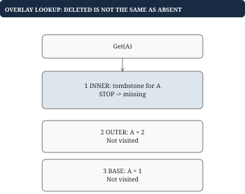

# Chapter 11 — Modeling larger practical programs

A practical prompt becomes manageable when you separate observable behavior, state, and transitions.

## An in-memory filesystem

Directories have named children; files have contents. A tree mirrors this relationship. Resolve a path by splitting it into components and following child maps. Lookup costs O(number of components), plus string-processing cost. Listing a directory is proportional to its children, with additional sorting if the output must be lexical.

Before implementation, define whether repeated separators are allowed, whether dot and dot-dot are normalized, whether missing parents are created, and whether a file can be overwritten by a directory. You can deliberately restrict the first version to absolute normalized paths. State that restriction instead of silently implementing incomplete path semantics.

Move is not merely deleting one map entry and inserting another. Reject moving a directory inside its own descendant; otherwise you introduce a cycle or detach an entire subtree incorrectly. Validate destination rules before mutating either parent so failed moves leave the filesystem unchanged. Copy requires new nodes; sharing the old subtree would make edits to one copy change the other.

## A transactional key-value store

Start with a base map and a stack of transaction overlays. Reads search overlays newest to oldest, then the base. Each overlay stores either a value or a tombstone representing deletion. A missing overlay entry means “keep searching”; a tombstone means “the key is absent.” Confusing those two states makes deleted values reappear from lower layers.

Begin pushes an empty overlay. Rollback discards the top overlay. Commit merges it into its parent overlay, or into the base if no parent exists. For nested transactions, an inner commit does not necessarily make changes durable outside the outer transaction. Our contract keeps them within the outer transaction until that transaction commits.

Trace base A equals five. Begin outer and set A to ten. Begin inner and set A to twenty. Commit inner: the outer overlay now holds twenty. Roll back outer: base A is five again. If your implementation committed the inner overlay directly to base, it violates this contract. Reads cost O(depth) map lookups; committing costs proportional to the top overlay's changes.

**Failure case.** Removing a key from an overlay cannot hide a value that still exists in a lower layer.

Removing the overlay entry exposes the older base value. A tombstone must stop lookup and report absence. This is the same distinction between “no update here” and “an explicit deletion” that appears in temporal storage and merge systems.

## Pub/sub and callback ownership

Use topic to subscriber-ID to callback maps. Return a subscriber ID from Subscribe; arbitrary Go function values cannot be compared to each other for equality, so callback identity alone is not a suitable map key. On Publish, copy the current subscriber callbacks while holding the lock, release it, then invoke the copy. This allows callbacks to subscribe or unsubscribe without deadlocking or invalidating map iteration.

Define snapshot semantics: a subscriber removed during a publication may still receive that publication if it was in the snapshot. A synchronous slow callback delays later callbacks. Asynchronous delivery needs bounded buffers and a backpressure or drop policy; spawning unbounded goroutines transfers the problem into memory growth. Decide whether callback panics propagate or are recovered at the API boundary. These are behavioral choices with tests, not just implementation details.

## A playback metadata service

Compose the previous lessons around GetPlayback. Validate user and video inputs. Check metadata cache. On a fresh hit, return the cached metadata. On a miss, join or initiate the per-key load. If loading succeeds, publish it with TTL and capacity accounting. If it fails, return an error or an explicitly allowed stale value. Expiration, eviction, and in-flight loading have different purposes.

Define metrics precisely. One request can be a cache miss while joining an already-running load, so backend-load count need not equal miss count. A stale value served under an outage policy needs its own metric if you care about freshness. Do not cache authorization decisions under video ID alone; user-specific data requires an appropriate key or a separate authorization check.

What if an object is larger than the memory budget? Return the successful backend result to the caller while declining to cache it under our chosen policy. Cache admission failure need not mean playback failure. What if twenty callers cancel while one remains? Shared load lifetime and individual waiting lifetimes are separate decisions.

## Model a small program as a sequence of valid transitions

A larger coding prompt often overwhelms because it introduces several methods at once. Reduce it to a state machine: what is the state before a call, which preconditions allow the call, which mutations happen, and what must be true when it returns? You do not need formal notation. You need an operation sequence precise enough that another person could act as the computer.

For a filesystem move, the state consists of nodes and parent-child relationships. A successful move changes two relationships: remove the source from its old parent and add it under the destination parent. But checking whether the destination exists, whether the new name conflicts, and whether a cycle would be created should normally happen first. Otherwise a failed validation can leave the source detached. This is the same “validate before destructive mutation” principle used for oversized cache admission.

A transaction overlay illustrates a different modeling skill: representing absence separately from no change. If an upper layer does not mention key A, read the lower layer. If the upper layer says A was deleted, stop and report missing. Both situations lack a normal value in the upper layer, but they have different behavior. A tombstone preserves that distinction. Many subtle bugs are really failures to represent two semantically different states separately.

Callbacks make ownership and reentrancy visible. A pub/sub system owns its subscriber registry, but a callback is arbitrary user-controlled work. Holding the registry lock while executing that callback extends the lock across code whose duration and behavior you do not control. Taking a snapshot of subscribers separates the protected registry operation from later delivery. The snapshot policy then becomes part of the contract: a subscriber removed after the snapshot may still receive the current message.

Composition adds another dimension. A playback service can validate access, look up metadata, join an in-flight load, and update metrics. Keeping each responsibility explicit helps you reason about errors. A successful backend response that is too large to cache can still be returned. A cache miss that joins another caller's load need not cause another backend request. “Request failed,” “cache did not admit,” and “load was shared” should not collapse into one undifferentiated status.

## Worked example: deletion is a value in the transaction overlay

The base map contains A:1. Begin an outer transaction and set A to two. Begin an inner transaction and delete A. A lookup must report missing, even though both lower layers still contain a value. The inner deletion is therefore represented by a tombstone, not by removing A from the inner map.

| Operation | Base | Outer overlay | Inner overlay | Visible A |
| --- | --- | --- | --- | --- |
| Initial | A:1 | None | None | 1 |
| Begin; Set A=2 | A:1 | A:2 | None | 2 |
| Begin; Delete A | A:1 | A:2 | A:deleted | Missing |
| Commit inner | A:1 | A:deleted | None | Missing |
| Roll back outer | A:1 | None | None | 1 |

Committing the inner layer copies its tombstone into the outer layer. It does not delete A from the base yet. Otherwise rolling back the outer transaction could not restore the original state. When the outermost transaction commits, applying its tombstone finally removes A from the base.

Each overlay lookup has three outcomes: a value is present, a tombstone is present, or this layer says nothing. Only the third outcome permits searching older layers. This is a small instance of a broad modeling rule: absence of an instruction and an instruction to remove something are different states.

## Worked example: define what a publish snapshot means

A topic currently has subscribers A and B. Publish copies the subscriber list under a lock, then releases the lock before calling callbacks. During A's callback, A unsubscribes B. The snapshot still contains B, so B receives this publication under snapshot semantics. Future publications omit B.

This is a reasonable contract, but it must be explicit. A stronger promise that unsubscribe prevents every later callback invocation would need additional coordination and a decision about a callback already in flight. Invoking arbitrary callbacks while holding the registry lock is a tempting shortcut that can deadlock when A calls unsubscribe on the same registry.

| Event | Live registry | Current publish snapshot |
| --- | --- | --- |
| Publish begins | A, B | A, B |
| A removes B | A | A, B |
| B callback runs | A | A, B |
| Next publish | A | A |

Copying the subscriber list solves ownership of the list, not every failure policy. Synchronous callbacks mean one slow subscriber delays later ones. Asynchronous delivery requires queue bounds, cancellation, and an overflow policy. A callback panic also needs an explicit policy if the prompt expects continued delivery. The first implementation should fulfill a small stated contract; extensions should name the new state and guarantee they introduce.

## Putting the program together: nested transactions

The database exposes Begin, Get, Set, Delete, Commit, and Rollback. Outside a transaction, writes affect a base map. Inside a transaction, they affect only the newest overlay. An overlay entry is either a value or a deletion marker. Commit merges the newest overlay into its parent if one exists, otherwise into the base. Commit or Rollback with no active transaction returns an error without mutation.

Begin pushes an empty map onto a stack. Set stores a value entry in the top overlay, or the base when the stack is empty. Delete stores a tombstone in the top overlay, or removes the base entry outside a transaction. Get searches overlays newest to oldest. A value returns immediately, a tombstone returns missing, and no entry continues the search. Only after all overlays are silent does it read the base.

Commit first checks that an overlay exists. Remove that overlay from the stack, then merge each change into the new top layer. Copy both values and tombstones into a parent overlay so deletions remain explicit. When committing into the base, a tombstone performs an actual delete and a value performs an assignment. Rollback simply discards the newest overlay. These operations define nesting without needing to copy the entire database at each Begin.

With base A equal to five, Begin then Set A to ten affects only the outer overlay. Begin again and Set A to twenty affects the inner one. Commit inner moves twenty into outer. Rollback outer discards it, leaving base five. If inner Delete A is committed instead, the outer overlay must contain a tombstone; merely deleting A from the overlay would reveal the original five too early.

Get costs up to one map lookup per active depth. Commit work is proportional to the number of changes in the top overlay. This is a single-threaded nesting model, not an implementation of all database isolation levels. Adding concurrent transactions requires a visibility and conflict policy beyond simply putting a mutex around each method.
