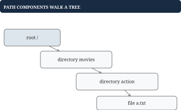
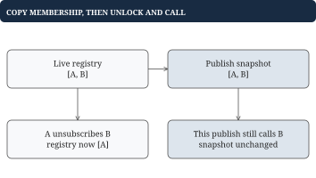

# Chapter 11 - Modeling larger practical programs

A larger exercise usually introduces several methods and shared invariants. This chapter models a filesystem, nested transactions, pub/sub delivery, and a cached playback service. For each, begin with the observable behavior and a small valid transition; the method names alone do not define the contract.

## Filesystem: paths traverse named child maps

**Problem.** Support directories and file contents in memory. After creating `/movies/action` and writing `/movies/action/a.txt`, reading that path returns its contents and listing `/movies` returns `["action"]`.

Restrict the first version to normalized absolute paths without repeated separators, '.' or '..'. A file has contents; a directory has children. The tree represents ownership, not just path strings.



| Operation | Required behavior |
| --- | --- |
| mkdir | Create directory; define missing-parent policy |
| write | Store contents; reject treating a directory as a file |
| read | Return file contents and presence/error |
| ls | List directory children, sorted if promised |
| delete | Define whether nonempty directories may be removed |
| move | Validate both ends before mutation; reject descendant cycles |
| copy | Create independent nodes, not shared child maps |

## Go example: resolve already validated path components

This is the path-resolution core, not a complete filesystem. The caller splits a normalized path into components such as `["movies", "action", "a.txt"]`, and the root is an existing directory.

```go
type FSNode struct {
	IsFile   bool
	Content  string
	Children map[string]*FSNode
}

func Resolve(root *FSNode,
	parts []string) (*FSNode, bool) {
	current := root
	for _, name := range parts {
		// A file cannot serve as an intermediate directory.
		if current == nil || current.IsFile {
			return nil, false
		}
		current = current.Children[name]
		if current == nil {
			return nil, false
		}
	}
	return current, current != nil
}
```

For the valid example, resolve movies, then action, then a.txt. A missing child or a file before the end fails. The empty component list resolves root. Work is expected O(depth) child lookups plus hashing/path parsing; this iterative core uses O(1) auxiliary state.

Moving `/movies` inside `/movies/action` would create a cycle. Validate ancestry, source existence, and destination collision before unlinking anything, so a rejected move preserves state. A deep copy must recreate child maps and nodes. Concurrency requires a lock around the complete multi-parent mutation, not independent locks around each map write.

## Nested transactions: overlays contain instructions

**Problem.** Start with base `{A: "1"}`. Begin an outer transaction, set A to "2", begin an inner transaction, delete A, commit inner, then roll back outer. The final visible A must be "1".

A transaction overlay maps keys to edits. Reads search newest overlay first. An edit can mean a value, deletion, or no instruction. Only no instruction permits searching older layers. A deletion tombstone must stop lookup.


## Worked example: inner commit does not bypass outer rollback

| Action | Base | Outer | Inner | Visible A |
| --- | --- | --- | --- | --- |
| Initial | `{A:1}` | None | None | 1 |
| Begin; Set A=2 | `{A:1}` | `{A:2}` | None | 2 |
| Begin; Delete A | `{A:1}` | `{A:2}` | `{A:deleted}` | Missing |
| Commit inner | `{A:1}` | `{A:deleted}` | None | Missing |
| Rollback outer | `{A:1}` | None | None | 1 |

Committing inner merges into outer; it must not delete base A yet. Otherwise outer rollback could not restore the original value. Nested transactions here are single-session overlays, not a claim about concurrent database isolation.

## Go example: layered reads distinguish absence and deletion

```go
type Edit struct {
	Value   string
	Deleted bool
}

func ReadLayered(base map[string]string,
	layers []map[string]Edit, key string) (string, bool) {
	for i := len(layers) - 1; i >= 0; i-- {
		edit, found := layers[i][key]
		if !found {
			continue
		}
		if edit.Deleted {
			// A tombstone hides every older value.
			return "", false
		}
		return edit.Value, true
	}
	value, found := base[key]
	return value, found
}
```

An edit with `Value: ""` and Deleted=false is a valid empty value. A missing map entry is no instruction. Deleting a key from an overlay would expose a lower value, so it cannot represent deleting the logical key.

## Putting the program together: begin, commit, and rollback

The following complete transaction stack initializes base lazily. Begin pushes an empty overlay. Rollback discards only the newest overlay. Commit copies its edits to the parent, or applies them to base when no parent remains.

```go
type TransactionStore struct {
	base   map[string]string
	layers []map[string]Edit
}

func (s *TransactionStore) Begin() {
	s.layers = append(s.layers, make(map[string]Edit))
}

func (s *TransactionStore) Change(key string, edit Edit) {
	if len(s.layers) > 0 {
		s.layers[len(s.layers)-1][key] = edit
		return
	}
	if s.base == nil {
		s.base = make(map[string]string)
	}
	if edit.Deleted {
		delete(s.base, key)
	} else {
		s.base[key] = edit.Value
	}
}

func (s *TransactionStore) Rollback() bool {
	if len(s.layers) == 0 {
		return false
	}
	last := len(s.layers) - 1
	// Release the discarded map from the backing array.
	s.layers[last] = nil
	s.layers = s.layers[:last]
	return true
}
```

Commit reuses Change after removing the newest layer, so Change naturally targets its parent or base.

```go
func (s *TransactionStore) Commit() bool {
	if len(s.layers) == 0 {
		return false
	}
	last := len(s.layers) - 1
	top := s.layers[last]
	s.layers[last] = nil
	s.layers = s.layers[:last]
	// Change now targets the parent overlay or the base.
	for key, edit := range top {
		s.Change(key, edit)
	}
	return true
}

func (s *TransactionStore) Get(key string) (string, bool) {
	return ReadLayered(s.base, s.layers, key)
}
```

A read costs expected O(transaction depth); commit costs O(changes in the top layer). Rollback discards a layer in O(1), excluding later garbage collection. Clearing the removed slice slot prevents its backing array from retaining the overlay map. Call Commit or Rollback without an active transaction and receive false, with no mutation. Concurrency needs an explicit session/isolation contract before adding locks around this shared stack.

## Pub/sub: callbacks need a delivery snapshot

**Problem.** Subscribers A and B receive a message. During A's callback, A unsubscribes B. Under snapshot semantics, B still receives this publication because it was subscribed at the start; the next publication excludes B.



A topic maps subscriber IDs to callbacks. Return an ID from Subscribe: arbitrary Go function values cannot be equality-compared to identify subscriptions. Calling callbacks while holding the registry lock can deadlock when a callback subscribes or unsubscribes.

## Worked example: live registry and current snapshot differ

| Event | Live subscribers | Publish snapshot |
| --- | --- | --- |
| Publish begins | `[A, B]` | `[A, B]` |
| A unsubscribes B | `[A]` | `[A, B]` |
| B is called | `[A]` | `[A, B]` |
| Next publish | `[A]` | `[A]` |

The core below accepts a prebuilt registry and promises no callback order. Mutation methods must use the same mutex.

```go
type TopicBus struct {
	mu        sync.Mutex
	callbacks map[string]map[int]func(string)
}

func (b *TopicBus) Publish(topic, message string) {
	b.mu.Lock()
	var snapshot []func(string)
	for _, callback := range b.callbacks[topic] {
		snapshot = append(snapshot, callback)
	}
	b.mu.Unlock()
	// Callbacks may safely change subscriptions after unlock.
	for _, callback := range snapshot {
		callback(message)
	}
}
```

The lock protects membership copying; it does not cover user callbacks. Cost is O(s) for s subscribers plus their work, with O(s) snapshot space. This synchronous core lets one slow callback delay later ones and lets a panic propagate. Asynchronous delivery adds queue bounds, cancellation, ordering, and an overflow policy; unbounded goroutines do not solve backpressure.

## Playback service: compose the contracts already defined

**Problem.** `GetPlayback(user, video)` uses an expensive metadata backend. Cache fresh metadata, share concurrent loads, bound cache space, and report errors and hit/miss metrics. Authorization remains a separate per-user check.

| Step | Decision and state change |
| --- | --- |
| Validate/authorize | Confirm this user may request this video |
| Fresh cache lookup | Hit returns metadata; miss continues |
| Join/create load | One leader fetches; followers wait |
| Backend response | Share success or error with every waiter |
| Admission | Successful oversized metadata may be returned without caching |
| Metrics | Count request hit/miss separately from backend loads |

If 3 requests miss A and share one fetch, record 3 misses and 1 backend load. Admission rejection is not backend failure. If stale data may be served during an outage, specify its freshness limit and measure that outcome separately.

The cache key must cover the metadata's identity. Do not cache a user-specific authorization decision under video ID alone. A late response after invalidation may require a version check before admission. Cancellation of one caller need not cancel shared work still needed by other callers.

Start with the smallest stated behavior, then name the additional state for each follow-up. A service composition is understandable when every method preserves the local contracts rather than hiding them behind one large function.
