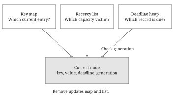
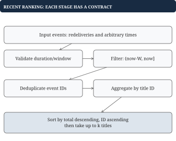

# Chapter 12 - Complete interview case studies

These cases assemble the earlier techniques into complete programs. Each starts with a brief and a concrete trace, then shows code in dependency order. The first implements an LRU cache with TTL using a simple correct cleanup baseline. The second filters, deduplicates, aggregates, and ranks recent viewing events. You can follow both without executing anything.

## Case one: fresh metadata with bounded recency

**Brief.** Implement a single-threaded metadata cache with Put(key, value, ttl) and Get(key). Capacity limits resident entries. Never return an expired value. Reads and writes promote live entries. Before evicting a live LRU entry, remove expired residents. Inject the clock.

Choose exact rules: capacity<=0 stores nothing; `now >= deadline` means expired; ttl<=0 removes the key; an overwrite resets deadline and promotes; Get does not extend TTL; empty strings are valid values. Tick arithmetic must fit int64.

## Worked example: expiration wins over recent access

Use capacity 2 and begin at time 0. Put A with TTL 5, B with TTL 20, and Get A. A is now most recent, but it still expires at 5.

| Time | Operation | MRU to LRU | Deadlines |
| --- | --- | --- | --- |
| 0 | Put A="HD", TTL 5 | `[A]` | `{A:5}` |
| 0 | Put B="UHD", TTL 20 | `[B, A]` | `{A:5, B:20}` |
| 0 | Get A | `[A, B]` | Unchanged |
| 5 | Put C="HDR", TTL 20 | `[C, B]` | `{B:20, C:25}` |
| 6 | Put C="new", TTL 50 | `[C, B]` | `{B:20, C:56}` |
| 25 | Get C | `[C, B]` | Return `("new", true)` |

At time 5, removing only the LRU tail B would violate the expired-first rule. A is expired at the front. Freshness and recency have different orderings.



The diagram shows the heap-based optimization from chapter 7. The complete implementation below deliberately uses a map scan for cleanup, so its correctness does not depend on a third index. That scan is the operation we would later optimize.

## Go example: state and constructor

A node has stable identity, value, deadline, and two list neighbors. The map and list must describe the same residents. Sentinels are never residents.

```go
type metadataNode struct {
	key, value string
	deadline   int64
	prev, next *metadataNode
}

type MetadataCache struct {
	capacity   int
	clock      func() int64
	byKey      map[string]*metadataNode
	head, tail *metadataNode
}

func NewMetadataCache(capacity int,
	clock func() int64) *MetadataCache {
	if capacity < 0 {
		capacity = 0
	}
	head, tail := &metadataNode{}, &metadataNode{}
	head.next, tail.prev = tail, head
	return &MetadataCache{
		capacity: capacity, clock: clock,
		byKey: make(map[string]*metadataNode),
		head:  head, tail: tail,
	}
}
```

The clock must be non-nil and monotone. No mutex is present; callers serialize operations. This is a complete count-and-TTL baseline, not a distributed cache.

## Helpers update one invariant at a time

Unlink updates only neighbor links. Promote unlinks an already resident node before inserting it at the front. Remove updates both list and map.

```go
func unlinkMetadata(n *metadataNode) {
	n.prev.next = n.next
	n.next.prev = n.prev
}

func (c *MetadataCache) front(n *metadataNode) {
	first := c.head.next
	n.prev, n.next = c.head, first
	c.head.next, first.prev = n, n
}

func (c *MetadataCache) remove(n *metadataNode) {
	unlinkMetadata(n)
	delete(c.byKey, n.key)
}

func (c *MetadataCache) expire(now int64) {
	for _, n := range c.byKey {
		if n.deadline <= now {
			c.remove(n)
		}
	}
}
```

Deleting the current map entry during Go map iteration is allowed. The scan may remove several list positions; stable node pointers make that safe. Each removal preserves the neighbors' connection. Removed nodes are no longer used, so clearing their own links is optional for this implementation.

## Get: check freshness before promoting

```go
func (c *MetadataCache) Get(key string) (string, bool) {
	n, found := c.byKey[key]
	if !found {
		return "", false
	}
	if c.clock() >= n.deadline {
		// Expiration takes precedence over recency promotion.
		c.remove(n)
		return "", false
	}
	unlinkMetadata(n)
	c.front(n)
	return n.value, true
}
```

A hit promotes without changing deadline. A miss does not change recency; an expired lookup removes that one resident. Expected time is O(1), and an empty value still returns true.

## Put: cleanup before live capacity eviction

```go
func (c *MetadataCache) Put(key, value string,
	ttl int64) {
	if ttl <= 0 {
		if n, found := c.byKey[key]; found {
			c.remove(n)
		}
		return
	}
	if c.capacity == 0 {
		return
	}
	now := c.clock()
	// Reclaim expired residents before evicting a live one.
	c.expire(now)
	n, found := c.byKey[key]
	if found {
		unlinkMetadata(n)
	} else {
		n = &metadataNode{key: key}
		c.byKey[key] = n
	}
	n.value, n.deadline = value, now+ttl
	c.front(n)
	if len(c.byKey) > c.capacity {
		c.remove(c.tail.prev)
	}
}
```

At time 5, expire removes A regardless of its recency, then C fits beside B. An overwrite reuses its node. Completed Put satisfies count<=capacity and no resident was expired at its sampled now. The map/list correspondence remains one-to-one.

The baseline Put is O(n) because it scans residents. Space is O(capacity), Get expected O(1). A deadline heap changes the cleanup cost to due-record work plus heap updates; generations must guard stale records. A used-weight counter changes count capacity into weighted capacity and may require several live evictions.

## Checking the complete cache

A controllable clock makes these tests concrete:

| Input/transition | Required outcome |
| --- | --- |
| Capacity 0; Put A | Always missing |
| Put A="" with live TTL | `("", true)` |
| Get at exact deadline | Missing; unlink and delete |
| Refresh before old deadline | New deadline governs reads |
| Repeated Put A | One A node only |
| Expired MRU; insert C | Expired A leaves before live B |
| Hit already-first node | List remains connected |

For concurrency, wrap each complete method in one exclusive lock. For backend loading, use chapter 7's SharedLoader outside the cache lock and recheck freshness inside shared work. Invalidation during a load needs a version policy. These follow-ups add explicit guarantees; they do not change the meaning of TTL silently.

## Case two: recent viewing totals and top titles

**Brief.** Given a batch of events, return the top k titles by total recent watch minutes. Event ID deduplicates redelivery. Include event times in `(now-window, now]`; exclude future events. Rank descending total, then ascending title ID. Input order is arbitrary and preserved.

Repeated IDs must have identical payloads. Durations are positive, sums and window-boundary arithmetic fit int64, and window>0. The public pipeline rejects invalid duration/window input. The event type omits user because this exercise ranks the supplied cohort; per-user ranking would require grouping or filtering by user too.

## Worked example: filter, deduplicate, then aggregate

Set now=10, window=5, k=2:

| Event ID | Title | Time | Minutes | Contribution |
| --- | --- | --- | --- | --- |
| e1 | A | 6 | 3 | A:+3 |
| e2 | A | 9 | 4 | A:+4 |
| e2 again | A | 9 | 4 | Duplicate; +0 |
| e3 | B | 10 | 7 | B:+7 |
| e4 | C | 5 | 100 | Exact left boundary; +0 |
| e5 | D | 11 | 20 | Future; +0 |

Totals are `{A: 7, B: 7}`. A wins the ID tie, so the result is `[(A, 7), (B, 7)]`. Filtering before deduplication is safe only because identical IDs carry identical timestamps and payloads. Conflicting redeliveries would need a canonicalization or rejection rule.



## Go example: preserve identity and aggregate contributions

```go
type WatchEvent struct {
	ID, Title   string
	At, Minutes int64
}

func RecentTotals(events []WatchEvent,
	now, window int64) map[string]int64 {
	seen := make(map[string]bool)
	totals := make(map[string]int64)
	for _, event := range events {
		// Exclude the left boundary and all future events.
		if event.At <= now-window || event.At > now {
			continue
		}
		if seen[event.ID] {
			continue
		}
		// Deduplicate deliveries by event ID, not title ID.
		seen[event.ID] = true
		totals[event.Title] += event.Minutes
	}
	return totals
}
```

This helper assumes validated positive durations and window. It does not mutate input. Each relevant logical event contributes exactly once because its ID is recorded before another delivery can add it. The set is by event ID; the totals map is by title ID. Confusing those keys either drops distinct views or double-counts redelivery.

## Putting the program together: validate and use the shared comparator

```go
func RecentRanking(events []WatchEvent,
	now, window int64, k int) ([]Candidate, bool) {
	if window <= 0 {
		return nil, false
	}
	// Validate the whole batch even when k is nonpositive.
	for _, event := range events {
		if event.Minutes <= 0 {
			return nil, false
		}
	}
	if k <= 0 {
		return nil, true
	}
	totals := RecentTotals(events, now, window)
	candidates := make([]Candidate, 0, len(totals))
	for title, minutes := range totals {
		candidates = append(candidates,
			Candidate{ID: title, Score: minutes})
	}
	return TopTitles(candidates, k), true
}
```

TopTitles and Candidate come from chapter 10; their definitions are part of the same example package. The boolean here reports valid input, not whether an event exists. Validation runs even for k<=0 under this contract. An empty valid batch returns an empty ranking; k larger than available titles returns all.

For n deliveries and u live titles, expected scan work is O(n), sorting O(u log u), and auxiliary state O(n+u). A k-winner heap reduces selection work but does not eliminate the deduplication set or totals map.

## Turning the batch into a stream

A batch can scan arbitrary order, but a FIFO streaming expiry queue requires monotone event times. Keep each accepted contribution `(ID, title, time, minutes)` so expiration can subtract it from the title's aggregate. Deduplication retention must cover the same query horizon or another explicitly defined horizon.

## Worked example: remove the contribution before reranking

At now=9, width=10, A has events `(time 0, minutes 10)` and `(time 9, minutes 3)`, while B has `(time 8, minutes 6)`. Totals are `{A: 13, B: 6}` and top 1 is A. At now=10, A's time-0 event reaches the excluded boundary and expires.

| State | A total | B total | Top 1 |
| --- | --- | --- | --- |
| Before expiry | 13 | 6 | A |
| Subtract A's old 10 | 3 | 6 | B |

Chapter 10's RollingStats retains the contribution to reverse. Ranking all current aggregates is a simple exact baseline. A winner-only heap cannot recover B if it discarded B earlier; dynamic score decreases require retaining outsiders too.

Both cases follow one method: state the result and boundaries, build a correct baseline, show every mutation on a tiny input, then identify the specific expensive step to optimize. The code and trace must agree on the same contract before any complexity improvement is useful.
